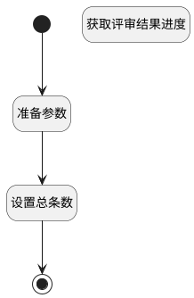

## 获取评审内容总条数 <!-- {docsify-ignore-all} -->

   获取评审内容总条数

### 处理过程




### 处理步骤说明

#### 开始 :id=Begin<sup class="footnote-symbol"> <font color=gray size=1>[开始]</font></sup>


#### 准备参数 :id=PREPAREJSPARAM1<sup class="footnote-symbol"> <font color=gray size=1>[准备参数]</font></sup>


1. 将`ctx(上下文).curstage_id` 设置给  `Default(传入变量).curstage_id`

#### 设置总条数 :id=RAWJSCODE1<sup class="footnote-symbol"> <font color=gray size=1>[直接前台代码]</font></sup>


<p class="panel-title"><b>执行代码</b></p>

```javascript
const total = uiLogic.ctrl.state.total;
const rows = uiLogic.grid.state.rows;
uiLogic.view.layoutPanel.state.data.total = rows.length;
if (rows && rows.length > 0) {
    let total_already = 0;
    rows.forEach(row => {
        const state = row.data.final_stage_results;
    if (state !== null && state !== undefined) {
        total_already++;
    }
    });
    uiLogic.view.layoutPanel.state.data.total_already = total_already;
    const floatTotal = parseFloat(rows.length);
    const floatTotalAlready = parseFloat(total_already);
    const ratio = Math.round((floatTotalAlready / floatTotal) * 100); 
    uiLogic.view.layoutPanel.state.data.schedule = ratio;
} 

```

#### 获取评审结果进度 :id=DEACTION1<sup class="footnote-symbol"> <font color=gray size=1>[实体行为]</font></sup>


调用实体 [评审内容(REVIEW_CONTENT)](module/TestMgmt/review_content.md) 行为 [Get](module/TestMgmt/review_content#行为) ，行为参数为`Default(传入变量)`

#### 结束 :id=END1<sup class="footnote-symbol"> <font color=gray size=1>[结束]</font></sup>


### 实体逻辑参数

|    中文名   |    代码名    |  数据类型      |备注 |
| --------| --------| --------  | --------   |
|表格|grid|部件对象||
|当前视图对象|VIEW|当前视图对象||
|上下文|ctx|导航视图参数绑定参数||
|传入变量(<i class="fa fa-check"/></i>)|Default|数据对象||
|当前部件对象|CTRL|当前部件对象||
