## 获取评审数据 <!-- {docsify-ignore-all} -->

   

### 处理过程

```plantuml
@startuml
hide footbox
<style>
root {
  HyperlinkColor #42b983
}
</style>

hide empty description
state "开始" as Begin <<start>> [[$./get_review_data#begin {开始}]]
state "注入脚本代码" as RAWJSCODE1  [[$./get_review_data#rawjscode1 {注入脚本代码}]]
state "结束" as END1 <<end>> [[$./get_review_data#end1 {结束}]]


Begin --> RAWJSCODE1
RAWJSCODE1 --> END1


@enduml
```




### 处理步骤说明

#### 开始 :id=Begin<sup class="footnote-symbol"> <font color=gray size=1>[开始]</font></sup>


#### 结束 :id=END1<sup class="footnote-symbol"> <font color=gray size=1>[结束]</font></sup>


#### 注入脚本代码 :id=RAWJSCODE1<sup class="footnote-symbol"> <font color=gray size=1>[直接前台代码]</font></sup>


<p class="panel-title"><b>执行代码</b></p>

```javascript
const appDataEntityId = 'plmweb.review_content';
const context = uiLogic.ctx;
const data_arr = uiLogic.default;

const keyMapping = {
    srfkey: 'target_id',
};

const propertyMap = uiLogic.view.model.appViewParams?.find(
    item => item.key.toLowerCase() === 'PROPERTYMAP'.toLowerCase(),
);

if (propertyMap) {
    const keyValuePairs = propertyMap.value.split(',');
    // 遍历键值对数组并添加到 keyMapping 映射对象中
    for (const pair of keyValuePairs) {
        const [sourceKey, targetKey] = pair.split(':');
        if (sourceKey && targetKey) {
            keyMapping[sourceKey] = targetKey;
        }
    }
}

// *转换属性
const addData = data_arr.map(item => {
    const tempData = {};
    // 遍历映射对象，将属性从 item 复制到 tempData
    Object.keys(keyMapping).forEach(key => {
        const targetKey = keyMapping[key];
        tempData[targetKey] = item[key];
    });
    // 获取 change_version 中 from 对象的 owner_type
    const ownerType = context.principal_type.toUpperCase();
    // 将 target_type 字段设置为 owner_type
    tempData['target_type'] = ownerType;
    keyMapping['srfkey'] = item['id'];
    return tempData;
});

// 获取实体服务并调用创建接口
const service = ibiz.hub.getApp(context.srfappid).deService;
service.exec(appDataEntityId, 'Create', context, addData);

```


### 实体逻辑参数

|    中文名   |    代码名    |  数据类型      |备注 |
| --------| --------| --------  | --------   |
|传入变量(<i class="fa fa-check"/></i>)|Default|数据对象列表||
|view|view|当前视图对象||
|应用上下文|ctx|导航视图参数绑定参数||
