## 打开评审结果 <!-- {docsify-ignore-all} -->

   打开评审结果

### 处理过程

```plantuml
@startuml
hide footbox
<style>
root {
  HyperlinkColor #42b983
}
</style>

hide empty description
state "开始" as Begin <<start>> [[$./open_result#begin {开始}]]
state "注入脚本代码" as RAWJSCODE2  [[$./open_result#rawjscode2 {注入脚本代码}]]
state "绑定父视图及表单" as PREPAREJSPARAM1  [[$./open_result#preparejsparam1 {绑定父视图及表单}]]
state "调试逻辑参数" as DEBUGPARAM1  [[$./open_result#debugparam1 {调试逻辑参数}]]


Begin --> DEBUGPARAM1
DEBUGPARAM1 --> PREPAREJSPARAM1
PREPAREJSPARAM1 --> RAWJSCODE2


@enduml
```




### 处理步骤说明

#### 开始 :id=Begin<sup class="footnote-symbol"> <font color=gray size=1>[开始]</font></sup>


#### 绑定父视图及表单 :id=PREPAREJSPARAM1<sup class="footnote-symbol"> <font color=gray size=1>[准备参数]</font></sup>


1. 将`view(当前视图对象).parentView` 绑定给  `parent_view(父视图)`
2. 将`parent_view(父视图).layoutPanel.panelItems.form` 绑定给  `parent_form(父表单)`

#### 注入脚本代码 :id=RAWJSCODE2<sup class="footnote-symbol"> <font color=gray size=1>[直接前台代码]</font></sup>


<p class="panel-title"><b>执行代码</b></p>

```javascript
const choose_data = uiLogic.parent_form.control.details.choosed_content;
choose_data.setDataValue(uiLogic.default.id);
uiLogic.parent_form.control.details.grouppanel6.state.keepAlive=true;
uiLogic.parent_form.control.details.grouppanel6.state.visible=false;
uiLogic.parent_form.control.details.review_results.state.visible=true;
```

#### 调试逻辑参数 :id=DEBUGPARAM1<sup class="footnote-symbol"> <font color=gray size=1>[调试逻辑参数]</font></sup>


> [!NOTE|label:调试信息|icon:fa fa-bug]
> 调试输出参数`当前容器对象`的详细信息


### 实体逻辑参数

|    中文名   |    代码名    |  数据类型      |备注 |
| --------| --------| --------  | --------   |
|传入变量(<i class="fa fa-check"/></i>)|Default|数据对象||
|父视图|parent_view|数据对象||
|选择的内容|choosed_content|数据对象||
|当前视图对象|view|当前视图对象||
|上下文|ctx|导航视图参数绑定参数||
|当前容器对象|cur_container|当前容器对象||
|父表单|parent_form|数据对象||
