## 评审内容版本比对 <!-- {docsify-ignore-all} -->

   评审内容版本比对

### 处理过程

```plantuml
@startuml
hide footbox
<style>
root {
  HyperlinkColor #42b983
}
</style>

hide empty description
state "开始" as Begin <<start>> [[$./review_content_version_comparison#begin {开始}]]
state "界面行为" as DEUIACTION1  [[$./review_content_version_comparison#deuiaction1 {界面行为}]]
state "注入脚本代码" as RAWJSCODE1  [[$./review_content_version_comparison#rawjscode1 {注入脚本代码}]]
state "结束" as END1 <<end>> [[$./review_content_version_comparison#end1 {结束}]]
state "准备参数" as PREPAREJSPARAM2  [[$./review_content_version_comparison#preparejsparam2 {准备参数}]]
state "准备参数" as PREPAREJSPARAM1  [[$./review_content_version_comparison#preparejsparam1 {准备参数}]]
state "调试逻辑参数" as DEBUGPARAM1  [[$./review_content_version_comparison#debugparam1 {调试逻辑参数}]]


Begin --> DEBUGPARAM1
DEBUGPARAM1 --> PREPAREJSPARAM1
PREPAREJSPARAM1 --> RAWJSCODE1
RAWJSCODE1 --> DEUIACTION1
DEUIACTION1 --> PREPAREJSPARAM2
PREPAREJSPARAM2 --> END1


@enduml
```




### 处理步骤说明

#### 开始 :id=Begin<sup class="footnote-symbol"> <font color=gray size=1>[开始]</font></sup>


#### 结束 :id=END1<sup class="footnote-symbol"> <font color=gray size=1>[结束]</font></sup>


#### 调试逻辑参数 :id=DEBUGPARAM1<sup class="footnote-symbol"> <font color=gray size=1>[调试逻辑参数]</font></sup>


> [!NOTE|label:调试信息|icon:fa fa-bug]
> 调试输出参数`传入变量`的详细信息

#### 注入脚本代码 :id=RAWJSCODE1<sup class="footnote-symbol"> <font color=gray size=1>[直接前台代码]</font></sup>


<p class="panel-title"><b>执行代码</b></p>

```javascript
const review_content = uiLogic.review_content;
const content_version = review_content.change_version;


if(content_version && content_version.length >0){
    content_version.forEach((c_version, index) => {
        if(c_version.srflistmapfield == 'from'){
            review_content.base_version = c_version.id;
        }
        if(c_version.srflistmapfield == 'to'){
            review_content.compare_version = c_version.id;
        }
    })

}


```

#### 界面行为 :id=DEUIACTION1<sup class="footnote-symbol"> <font color=gray size=1>[实体界面行为调用]</font></sup>


调用实体 [版本(VERSION)](module/Base/version.md) 界面行为 [评审内容版本对比](module/Base/version#界面行为) ，行为参数为`review_content(评审内容)`

#### 准备参数 :id=PREPAREJSPARAM2<sup class="footnote-symbol"> <font color=gray size=1>[准备参数]</font></sup>


1. 将`无值（NONE）` 设置给  `ctx(上下文).test_case`

#### 准备参数 :id=PREPAREJSPARAM1<sup class="footnote-symbol"> <font color=gray size=1>[准备参数]</font></sup>


1. 将`Default(传入变量)` 拷贝到  `review_content(评审内容)`
2. 将`Default(传入变量).target_id` 设置给  `ctx(上下文).test_case`


### 实体逻辑参数

|    中文名   |    代码名    |  数据类型      |备注 |
| --------| --------| --------  | --------   |
|上下文|ctx|导航视图参数绑定参数||
|评审内容|review_content|数据对象||
|传入变量(<i class="fa fa-check"/></i>)|Default|数据对象||
