## 保存评审结果 <!-- {docsify-ignore-all} -->

   

### 处理过程

```plantuml
@startuml
hide footbox
<style>
root {
  HyperlinkColor #42b983
}
</style>

hide empty description
state "开始" as Begin <<start>> [[$./save_review_result#begin {开始}]]
state "界面行为" as DEUIACTION1  [[$./save_review_result#deuiaction1 {界面行为}]]
state "结束" as END1 <<end>> [[$./save_review_result#end1 {结束}]]


Begin --> DEUIACTION1
DEUIACTION1 --> END1


@enduml
```

### 处理步骤说明

#### 开始 :id=Begin [开始]

#### 结束 :id=END1 [结束]

#### 界面行为 :id=DEUIACTION1 [实体界面行为调用]

调用实体 [评审内容(REVIEW_CONTENT)](module/TestMgmt/review_content.md) 界面行为 [编辑界面_保存操作](module/TestMgmt/review_content#界面行为) ，行为参数为`Default(传入变量)`

### 实体逻辑参数

|    中文名   |    代码名    |  数据类型      |备注 |
| --------| --------| --------  | --------   |
|传入变量(<i class="fa fa-check"/></i>)|Default|数据对象||
|上下文|ctx|导航视图参数绑定参数||
|当前视图对象|view|当前视图对象||
