## 开始当前阶段评审 <!-- {docsify-ignore-all} -->

   开始当前阶段评审

### 处理过程

```plantuml
@startuml
hide footbox
<style>
root {
  HyperlinkColor #42b983
}
</style>

hide empty description
state "开始" as Begin <<start>> [[$./start_cur_stage_review#begin {开始}]]
state "准备参数" as PREPAREJSPARAM1  [[$./start_cur_stage_review#preparejsparam1 {准备参数}]]
state "结束" as END1 <<end>> [[$./start_cur_stage_review#end1 {结束}]]
state "实体行为" as DEACTION1  [[$./start_cur_stage_review#deaction1 {实体行为}]]
state "注入脚本代码" as RAWJSCODE2  [[$./start_cur_stage_review#rawjscode2 {注入脚本代码}]]
state "消息弹窗" as MSGBOX1  [[$./start_cur_stage_review#msgbox1 {消息弹窗}]]
state "通知刷新" as RAWJSCODE1  [[$./start_cur_stage_review#rawjscode1 {通知刷新}]]


Begin --> PREPAREJSPARAM1
PREPAREJSPARAM1 --> MSGBOX1
MSGBOX1 --> DEACTION1
DEACTION1 --> RAWJSCODE2
RAWJSCODE2 --> RAWJSCODE1
RAWJSCODE1 --> END1


@enduml
```




### 处理步骤说明

#### 开始 :id=Begin<sup class="footnote-symbol"> <font color=gray size=1>[开始]</font></sup>


#### 结束 :id=END1<sup class="footnote-symbol"> <font color=gray size=1>[结束]</font></sup>


#### 准备参数 :id=PREPAREJSPARAM1<sup class="footnote-symbol"> <font color=gray size=1>[准备参数]</font></sup>


1. 将`ctx(上下文).curstage_id` 设置给  `Default(传入变量).curstage_id`
2. 将`view(当前视图).parentView` 设置给  `parent_view(父视图)`
3. 将`parent_view(父视图).layoutPanel.panelItems.form.control` 绑定给  `parent_form(父表单)`

#### 消息弹窗 :id=MSGBOX1<sup class="footnote-symbol"> <font color=gray size=1>[消息弹窗]</font></sup>


#### 实体行为 :id=DEACTION1<sup class="footnote-symbol"> <font color=gray size=1>[实体行为]</font></sup>


调用实体 [评审内容(REVIEW_CONTENT)](module/TestMgmt/review_content.md) 行为 [开始评审(start_review)](module/TestMgmt/review_content#行为) ，行为参数为`Default(传入变量)`

#### 注入脚本代码 :id=RAWJSCODE2<sup class="footnote-symbol"> <font color=gray size=1>[直接前台代码]</font></sup>


<p class="panel-title"><b>执行代码</b></p>

```javascript
const need_refresh = uiLogic.parent_form.details.need_refresh;
need_refresh.setDataValue(true);
```

#### 通知刷新 :id=RAWJSCODE1<sup class="footnote-symbol"> <font color=gray size=1>[直接前台代码]</font></sup>


<p class="panel-title"><b>执行代码</b></p>

```javascript
ibiz.mc.command.update.send({ srfdecodename: 'review', srfkey: context.review})
```


### 实体逻辑参数

|    中文名   |    代码名    |  数据类型      |备注 |
| --------| --------| --------  | --------   |
|父表单|parent_form|数据对象||
|表格|grid|部件对象||
|传入变量(<i class="fa fa-check"/></i>)|Default|数据对象||
|当前视图|view|当前视图对象||
|上下文|ctx|导航视图参数绑定参数||
|父视图|parent_view|数据对象||
