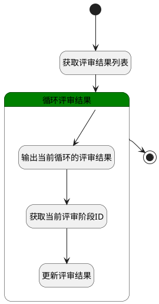

## 设置评审结果 <!-- {docsify-ignore-all} -->

   

### 处理过程

### 处理步骤说明

#### 开始 :id=Begin [开始]

*- N/A*
#### 获取评审结果列表 :id=PREPAREPARAM1 [准备参数]

1. 将`Default(传入变量).stage_results` 绑定给  `review_result_list(评审结果列表)`

#### 循环评审结果 :id=LOOPSUBCALL1 [循环子调用]

循环参数`review_result_list(评审结果列表)`，子循环参数使用`for_result(循环评审数据)`
#### 输出当前循环的评审结果 :id=DEBUGPARAM2 [调试逻辑参数]

> [!NOTE|label:调试信息|icon:fa fa-bug]
> 调试输出参数`for_result(循环评审数据)`的详细信息

#### 获取当前评审阶段ID :id=PREPAREPARAM2 [准备参数]

1. 将`for_result(循环评审数据).ID(标识)` 设置给  `result(评审结果).ID`
2. 将`Default(传入变量).COMMENT(评审意见)` 设置给  `result(评审结果).comment`
3. 将`Default(传入变量).cur_result_state` 设置给  `result(评审结果).result_state`

#### 更新评审结果 :id=DEACTION1 [实体行为]

调用实体 [评审结果(REVIEW_RESULT)](module/TestMgmt/review_result.md) 行为 [Update](module/TestMgmt/review_result#行为) ，行为参数为`result(评审结果)`

#### 结束 :id=END1 [结束]

*- N/A*

### 连接条件说明
#### 连接名称 

### 实体逻辑参数

|    中文名   |    代码名    |  数据类型    |  实体   |备注 |
| --------| --------| -------- | -------- | --------   |
|传入变量(<i class="fa fa-check"/></i>)|Default|数据对象|[评审结果(REVIEW_RESULT)](module/TestMgmt/review_result.md)||
|循环评审数据|for_result|数据对象|[评审结果(REVIEW_RESULT)](module/TestMgmt/review_result.md)||
|表单数据|form_date|数据对象|||
|评审结果|result|数据对象|||
|评审结果|review_result|数据对象|[评审结果(REVIEW_RESULT)](module/TestMgmt/review_result.md)||
|评审结果列表|review_result_list|数据对象列表|[评审结果(REVIEW_RESULT)](module/TestMgmt/review_result.md)||
