## 通过 <!-- {docsify-ignore-all} -->

   

### 处理过程

```plantuml
@startuml
hide footbox
<style>
root {
  HyperlinkColor #42b983
}
</style>

hide empty description
state "开始" as Begin <<start>> [[$./pass#begin {开始}]]
state "实体行为" as DEACTION1  [[$./pass#deaction1 {实体行为}]]
state "结束" as END1 <<end>> [[$./pass#end1 {结束}]]
state "准备参数" as PREPAREJSPARAM1  [[$./pass#preparejsparam1 {准备参数}]]


Begin --> PREPAREJSPARAM1
PREPAREJSPARAM1 --> DEACTION1
DEACTION1 --> END1


@enduml
```

### 处理步骤说明

#### 开始 :id=Begin [开始]

#### 结束 :id=END1 [结束]

#### 准备参数 :id=PREPAREJSPARAM1 [准备参数]

1. 将`Default(传入变量).content_id` 设置给  `review_content(评审内容).ID`
2. 将`Default(传入变量)` 设置给  `review_content(评审内容).stage_results`

#### 实体行为 :id=DEACTION1 [实体行为]

调用实体 [评审内容(REVIEW_CONTENT)](module/TestMgmt/review_content.md) 行为 [Update](module/TestMgmt/review_content#行为) ，行为参数为`review_content(评审内容)`

### 实体逻辑参数

|    中文名   |    代码名    |  数据类型      |备注 |
| --------| --------| --------  | --------   |
|当前视图对象|view|当前视图对象||
|传入变量(<i class="fa fa-check"/></i>)|Default|数据对象||
|评审内容|review_content|数据对象||
|当前表单|form|部件对象||
