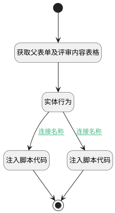

## 通过 <!-- {docsify-ignore-all} -->

   

### 处理过程




### 处理步骤说明

#### 注入脚本代码 :id=RAWJSCODE2<sup class="footnote-symbol"> <font color=gray size=1>[直接前台代码]</font></sup>


<p class="panel-title"><b>执行代码</b></p>

```javascript
const rows = uiLogic.content_grid.state.rows;
const ctx = uiLogic.ctx;

if (rows && rows.length > 0) {
    const cur_content_id = ctx.review_content;
    let next_content = null;
    let foundMatch = false;

    rows.forEach((row, index) => {
        const for_id = row.data.id;
        if (foundMatch) {
            next_content = row.data;
            foundMatch = false;
        }
        if (!foundMatch && for_id == cur_content_id) {
            foundMatch = true;
        }
    });

    const review_results_state = uiLogic.parent_form.control.details.review_results.state;
    review_results_state.keepAlive = true;
    review_results_state.visible = false;
    const grouppanel6_state = uiLogic.parent_form.control.details.grouppanel6.state;

    if (next_content) {
        ctx.review_content = next_content.id;
        grouppanel6_state.visible = false;
        const choose_data = uiLogic.parent_form.control.details.choosed_content;
        choose_data.setDataValue(next_content.id);
    } else {
        grouppanel6_state.visible = true;
        const choose_data = uiLogic.parent_form.control.details.choosed_content;
        choose_data.setDataValue(null);
    }
}
```

#### 开始 :id=Begin<sup class="footnote-symbol"> <font color=gray size=1>[开始]</font></sup>


#### 结束 :id=END1<sup class="footnote-symbol"> <font color=gray size=1>[结束]</font></sup>


#### 获取父表单及评审内容表格 :id=PREPAREJSPARAM1<sup class="footnote-symbol"> <font color=gray size=1>[准备参数]</font></sup>


1. 将`3` 设置给  `Default(传入变量).cur_result_state`
2. 将`view(当前视图对象).parentView` 绑定给  `parentView(父视图)`
3. 将`parentView(父视图).layoutPanel.panelItems.form` 绑定给  `parent_form(父表单)`
4. 将`parent_form(父表单).control.details.druipart4.embedView` 设置给  `grid_view(评审内容表格视图)`
5. 将`grid_view(评审内容表格视图).layoutPanel.panelItems.grid.control` 设置给  `content_grid(评审内容表格)`

#### 实体行为 :id=DEACTION1<sup class="footnote-symbol"> <font color=gray size=1>[实体行为]</font></sup>


调用实体 [评审内容(REVIEW_CONTENT)](module/TestMgmt/review_content.md) 行为 [设置评审结果(set_review_result)](module/TestMgmt/review_content#行为) ，行为参数为`Default(传入变量)`

将执行结果返回给参数`review_content(评审内容)`

#### 注入脚本代码 :id=RAWJSCODE3<sup class="footnote-symbol"> <font color=gray size=1>[直接前台代码]</font></sup>


<p class="panel-title"><b>执行代码</b></p>

```javascript
        uiLogic.parent_form.control.details.grouppanel6.state.visible=true;
        uiLogic.parent_form.control.details.review_results.state.keepAlive=true;
        uiLogic.parent_form.control.details.review_results.state.visible=false;
        const choose_data = uiLogic.parent_form.control.details.choosed_content;
        choose_data.setDataValue(null);
```

### 连接条件说明
#### 连接名称 :id=DEACTION1-RAWJSCODE2

```Default(传入变量).next_review``` EQ ```1```
#### 连接名称 :id=DEACTION1-RAWJSCODE3

```Default(传入变量).next_review``` NOTEQ ```1```


### 实体逻辑参数

|    中文名   |    代码名    |  数据类型      |备注 |
| --------| --------| --------  | --------   |
|父表单|parent_form|数据对象||
|评审内容|review_content|数据对象||
|传入变量(<i class="fa fa-check"/></i>)|Default|数据对象||
|评审内容表格|content_grid|数据对象||
|评审内容表格视图|grid_view|数据对象||
|当前表单|form|部件对象||
|当前视图对象|view|当前视图对象||
|父视图|parentView|数据对象||
|上下文|ctx|导航视图参数绑定参数||
