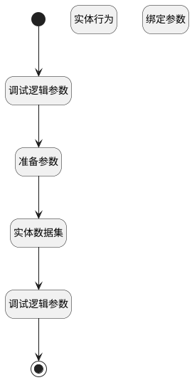

## 参与评审人 <!-- {docsify-ignore-all} -->

   

### 处理过程

### 处理步骤说明

#### 开始 :id=Begin [开始]

*- N/A*
#### 结束 :id=END1 [结束]

返回 `pages`

#### 调试逻辑参数 :id=DEBUGPARAM2 [调试逻辑参数]

> [!NOTE|label:调试信息|icon:fa fa-bug]
> 调试输出参数`Default(传入变量)`的详细信息

#### 准备参数 :id=PREPAREPARAM1 [准备参数]

1. 将`Default(传入变量).id(标识)` 设置给  `review.ID(标识)`

#### 实体数据集 :id=DEDATASET1 [实体数据集]

调用实体 [评审阶段(REVIEW_STAGE)](module/TestMgmt/review_stage.md) 数据集合 [数据集(DEFAULT)](module/TestMgmt/review_stage#数据集合) ，查询参数为`Default(传入变量)`

将执行结果返回给参数`pages`

#### 调试逻辑参数 :id=DEBUGPARAM1 [调试逻辑参数]

> [!NOTE|label:调试信息|icon:fa fa-bug]
> 调试输出参数`pages`的详细信息

#### 实体行为 :id=DEACTION1 [实体行为]

调用实体 [评审(REVIEW)](module/TestMgmt/review.md) 行为 [Get](module/TestMgmt/review#行为) ，行为参数为`review`

将执行结果返回给参数`review`

#### 绑定参数 :id=BINDPARAM1 [绑定参数]

绑定参数`review` 到 `reviewer_list(评审人列表)`

### 实体逻辑参数

|    中文名   |    代码名    |  数据类型    |  实体   |备注 |
| --------| --------| -------- | -------- | --------   |
|传入变量(<i class="fa fa-check"/></i>)|Default|过滤器|||
|pages|pages|分页查询|||
|review|review|数据对象|[评审(REVIEW)](module/TestMgmt/review.md)||
|评审人列表|reviewer_list|数据对象列表|[评审阶段(REVIEW_STAGE)](module/TestMgmt/review_stage.md)||
