## 选中阶段 <!-- {docsify-ignore-all} -->

   

### 处理过程

```plantuml
@startuml
hide footbox
<style>
root {
  HyperlinkColor #42b983
}
</style>

hide empty description
state "开始" as Begin <<start>> [[$./choose_stage#begin {开始}]]
state "准备参数" as PREPAREJSPARAM2  [[$./choose_stage#preparejsparam2 {准备参数}]]
state "绑定父级页面/表单" as PREPAREJSPARAM1  [[$./choose_stage#preparejsparam1 {绑定父级页面/表单}]]
state "设置选中值" as RAWJSCODE1  [[$./choose_stage#rawjscode1 {设置选中值}]]
state "取消选中值" as RAWJSCODE2  [[$./choose_stage#rawjscode2 {取消选中值}]]


Begin --> PREPAREJSPARAM1
PREPAREJSPARAM1 --> PREPAREJSPARAM2 : [[$./choose_stage#preparejsparam1-preparejsparam2{选中} 选中]]
PREPAREJSPARAM2 --> RAWJSCODE1
PREPAREJSPARAM1 --> RAWJSCODE2 : [[$./choose_stage#preparejsparam1-rawjscode2{取消选中} 取消选中]]


@enduml
```




### 处理步骤说明

#### 设置选中值 :id=RAWJSCODE1<sup class="footnote-symbol"> <font color=gray size=1>[直接前台代码]</font></sup>


<p class="panel-title"><b>执行代码</b></p>

```javascript
const cur_reviewer_id = uiLogic.parent_form.control.details.cur_reviewer_id;
cur_reviewer_id.setDataValue(uiLogic.default.reviewer);
const curstage_id = uiLogic.parent_form.control.details.curstage_id;
curstage_id.setDataValue(uiLogic.default.id);
```

#### 准备参数 :id=PREPAREJSPARAM2<sup class="footnote-symbol"> <font color=gray size=1>[准备参数]</font></sup>


1. 将`Default(传入变量).id` 设置给  `parent_view(父视图对象).context.curstage_id`
2. 将`Default(传入变量).stage_state` 设置给  `parent_view(父视图对象).context.curstage_state`

#### 开始 :id=Begin<sup class="footnote-symbol"> <font color=gray size=1>[开始]</font></sup>


#### 绑定父级页面/表单 :id=PREPAREJSPARAM1<sup class="footnote-symbol"> <font color=gray size=1>[准备参数]</font></sup>


1. 将`view(当前视图对象).parentView` 绑定给  `parent_view(父视图对象)`
2. 将`parent_view(父视图对象).layoutPanel.panelItems.form` 绑定给  `parent_form(父表单)`

#### 取消选中值 :id=RAWJSCODE2<sup class="footnote-symbol"> <font color=gray size=1>[直接前台代码]</font></sup>


<p class="panel-title"><b>执行代码</b></p>

```javascript
const cur_reviewer_id = uiLogic.parent_form.control.details.cur_reviewer_id;
cur_reviewer_id.setDataValue(null);
const curstage_id = uiLogic.parent_form.control.details.curstage_id;
curstage_id.setDataValue(null);
```

### 连接条件说明
#### 选中 :id=PREPAREJSPARAM1-PREPAREJSPARAM2

```Default(传入变量).id``` ISNOTNULL
#### 取消选中 :id=PREPAREJSPARAM1-RAWJSCODE2

```Default(传入变量).id``` ISNULL


### 实体逻辑参数

|    中文名   |    代码名    |  数据类型      |备注 |
| --------| --------| --------  | --------   |
|传入变量(<i class="fa fa-check"/></i>)|Default|数据对象||
|当前视图对象|view|当前视图对象||
|父表单|parent_form|数据对象||
|上下文|ctx|导航视图参数绑定参数||
|父视图对象|parent_view|数据对象||
|列表对象|list|部件对象||
