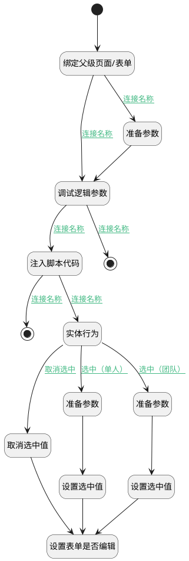

## 默认选中 <!-- {docsify-ignore-all} -->

   默认选中

### 处理过程




### 处理步骤说明

#### 准备参数 :id=PREPAREJSPARAM2<sup class="footnote-symbol"> <font color=gray size=1>[准备参数]</font></sup>


1. 将`Default(传入变量).id` 设置给  `parent_view(父视图对象).context.curstage_id`
2. 将`Default(传入变量).stage_state` 设置给  `parent_view(父视图对象).context.curstage_state`

#### 设置选中值 :id=RAWJSCODE1<sup class="footnote-symbol"> <font color=gray size=1>[直接前台代码]</font></sup>


<p class="panel-title"><b>执行代码</b></p>

```javascript
const cur_reviewer_id = uiLogic.parent_form.details.cur_reviewer_id;
cur_reviewer_id.setDataValue(uiLogic.default.reviewer);

const curstage_id = uiLogic.parent_form.details.curstage_id;
curstage_id.setDataValue(uiLogic.default.id);


```

#### 开始 :id=Begin<sup class="footnote-symbol"> <font color=gray size=1>[开始]</font></sup>


#### 绑定父级页面/表单 :id=PREPAREJSPARAM1<sup class="footnote-symbol"> <font color=gray size=1>[准备参数]</font></sup>


1. 将`list(列表对象).ctx.parent.controllersMap.get("reviewmain_view")` 绑定给  `parent_view(父视图对象)`
2. 将`list(列表对象).ctx.parent.controllersMap.get("form")` 绑定给  `parent_form(父表单)`

#### 调试逻辑参数 :id=DEBUGPARAM1<sup class="footnote-symbol"> <font color=gray size=1>[调试逻辑参数]</font></sup>


> [!NOTE|label:调试信息|icon:fa fa-bug]
> 调试输出参数`传入变量`的详细信息

#### 注入脚本代码 :id=RAWJSCODE4<sup class="footnote-symbol"> <font color=gray size=1>[直接前台代码]</font></sup>


<p class="panel-title"><b>执行代码</b></p>

```javascript
uiLogic.default = null;
uiLogic.list.state.selectedData=[];
let items = uiLogic.list.state.items;
let srfpersonid = uiLogic.ctx.srfpersonid;
for (let i = 0; i < items.length; i++) {
    if (items[i].reviewer === srfpersonid && items[i].stage_state === '20') {
        uiLogic.default = items[i];
        uiLogic.list.state.selectedData.push(items[i]);
        break;
    }
}
```

#### 实体行为 :id=DEACTION1<sup class="footnote-symbol"> <font color=gray size=1>[实体行为]</font></sup>


调用实体 [评审(REVIEW)](module/TestMgmt/review.md) 行为 [填充阶段评审人(fill_stage_reviewer)](module/TestMgmt/review#行为) ，行为参数为`Default(传入变量)`

将执行结果返回给参数`review_info(评审信息)`

#### 准备参数 :id=PREPAREJSPARAM3<sup class="footnote-symbol"> <font color=gray size=1>[准备参数]</font></sup>


1. 将`review_info(评审信息).cur_reviewer_id` 设置给  `parent_view(父视图对象).context.curstage_id`
2. 将`Default(传入变量).stage_state` 设置给  `parent_view(父视图对象).context.curstage_state`

#### 设置选中值 :id=RAWJSCODE3<sup class="footnote-symbol"> <font color=gray size=1>[直接前台代码]</font></sup>


<p class="panel-title"><b>执行代码</b></p>

```javascript
const cur_reviewer_id = uiLogic.parent_form.details.cur_reviewer_id;
cur_reviewer_id.setDataValue(uiLogic.review_info.cur_reviewer_id);

const curstage_id = uiLogic.parent_form.details.curstage_id;
curstage_id.setDataValue(uiLogic.default.id);
```

#### 设置表单是否编辑 :id=RAWJSCODE7<sup class="footnote-symbol"> <font color=gray size=1>[直接前台代码]</font></sup>


<p class="panel-title"><b>执行代码</b></p>

```javascript
uiLogic.list.ctx.parent.controllersMap.get("form").state.modified = false;
```

#### 准备参数 :id=PREPAREJSPARAM4<sup class="footnote-symbol"> <font color=gray size=1>[准备参数]</font></sup>


1. 将`list(列表对象).ctx.parent.controllersMap.get("reviewidea_main_view")` 设置给  `parent_view(父视图对象)`

#### 取消选中值 :id=RAWJSCODE2<sup class="footnote-symbol"> <font color=gray size=1>[直接前台代码]</font></sup>


<p class="panel-title"><b>执行代码</b></p>

```javascript
const cur_reviewer_id = uiLogic.parent_form.details.cur_reviewer_id;
cur_reviewer_id.setDataValue(null);
const curstage_id = uiLogic.parent_form.details.curstage_id;
curstage_id.setDataValue(null);
```

#### 结束 :id=END1<sup class="footnote-symbol"> <font color=gray size=1>[结束]</font></sup>


#### 结束 :id=END2<sup class="footnote-symbol"> <font color=gray size=1>[结束]</font></sup>


### 连接条件说明
#### 连接名称 :id=PREPAREJSPARAM1-PREPAREJSPARAM4

(```parent_view(父视图对象)``` EQ ```undefined``` OR ```parent_view(父视图对象)``` ISNULL)
#### 连接名称 :id=DEBUGPARAM1-RAWJSCODE4

```parent_form(父表单).details.state.value``` EQ ```20```
#### 连接名称 :id=RAWJSCODE4-DEACTION1

```Default(传入变量)``` ISNOTNULL AND ```Default(传入变量)``` NOTEQ ```undefined```
#### 选中（单人） :id=DEACTION1-PREPAREJSPARAM2

```Default(传入变量).id``` ISNOTNULL AND ```Default(传入变量).reviewer_type``` NOTEQ ```30```
#### 取消选中 :id=DEACTION1-RAWJSCODE2

```Default(传入变量).id``` ISNULL
#### 选中（团队） :id=DEACTION1-PREPAREJSPARAM3

```Default(传入变量).id``` ISNOTNULL AND ```Default(传入变量).reviewer_type``` EQ ```30```
#### 连接名称 :id=RAWJSCODE4-END2

```Default(传入变量)``` ISNULL AND ```Default(传入变量)``` EQ ```undefined```
#### 连接名称 :id=DEBUGPARAM1-END1

```parent_form(父表单).details.state.value``` NOTEQ ```20```
#### 连接名称 :id=PREPAREJSPARAM1-DEBUGPARAM1

(```parent_view(父视图对象)``` ISNOTNULL OR ```parent_view(父视图对象)``` NOTEQ ```undefined```)


### 实体逻辑参数

|    中文名   |    代码名    |  数据类型      |备注 |
| --------| --------| --------  | --------   |
|当前视图对象|view|当前视图对象||
|列表对象|list|部件对象||
|上下文|ctx|导航视图参数绑定参数||
|评审信息|review_info|数据对象||
|传入变量(<i class="fa fa-check"/></i>)|Default|数据对象||
|父视图对象|parent_view|数据对象||
|父表单|parent_form|数据对象||
