## 创建后附加评审规则 <!-- {docsify-ignore-all} -->

    进行中

### 处理过程

```plantuml
@startuml
hide empty description
<style>
root {
  HyperlinkColor #42b983
}
</style>

hide empty description
state "开始" as Begin <<start>> [[$./add_guideline_after_created#begin {"开始"}]]
state "获取流程准则ID" as PREPAREPARAM3  [[$./add_guideline_after_created#prepareparam3 {"获取流程准则ID"}]]
state "查询流程准则" as DEACTION1  [[$./add_guideline_after_created#deaction1 {"查询流程准则"}]]
state "获取步骤及类型" as PREPAREPARAM2  [[$./add_guideline_after_created#prepareparam2 {"获取步骤及类型"}]]
state "保存评审" as DEACTION2  [[$./add_guideline_after_created#deaction2 {"保存评审"}]]
state "结束" as END1 <<end>> [[$./add_guideline_after_created#end1 {"结束"}]]


Begin --> PREPAREPARAM3
PREPAREPARAM3 --> DEACTION1
DEACTION1 --> PREPAREPARAM2
PREPAREPARAM2 --> DEACTION2
DEACTION2 --> END1


@enduml
```

### 处理步骤说明

#### 开始 :id=Begin [开始]

*- N/A*
#### 获取流程准则ID :id=PREPAREPARAM3 [准备参数]

1. 将`Default(传入变量).GUIDELINE_ID(流程准则标识)` 设置给  `guideline_detail(选择的评审规则详情).ID(标识)`

#### 查询流程准则 :id=DEACTION1 [实体行为]

调用实体 [流程准则(GUIDELINE)](module/TestMgmt/guideline.md) 行为 [Get](module/TestMgmt/guideline#行为) ，行为参数为`guideline_detail(选择的评审规则详情)`

将执行结果返回给参数`guideline_detail(选择的评审规则详情)`

#### 获取步骤及类型 :id=PREPAREPARAM2 [准备参数]

1. 将`guideline_detail(选择的评审规则详情).REVIEW_STAGE(评审阶段)` 设置给  `Default(传入变量).STAGE(阶段)`
2. 将`guideline_detail(选择的评审规则详情).SUBJECT_TYPE(主题类型)` 设置给  `Default(传入变量).TYPE(评审类型)`

#### 保存评审 :id=DEACTION2 [实体行为]

调用实体 [评审向导(REVIEW_WIZARD)](module/TestMgmt/review_wizard.md) 行为 [Save](module/TestMgmt/review_wizard#行为) ，行为参数为`Default(传入变量)`

#### 结束 :id=END1 [结束]

*- N/A*

### 实体逻辑参数

|    中文名   |    代码名    |  数据类型    |  实体   |备注 |
| --------| --------| -------- | -------- | --------   |
|传入变量(<i class="fa fa-check"/></i>)|Default|数据对象|[评审向导(REVIEW_WIZARD)](module/TestMgmt/review_wizard.md)||
|选择的评审规则详情|guideline_detail|数据对象|[流程准则(GUIDELINE)](module/TestMgmt/guideline.md)||
