## 评审新建通知 <!-- {docsify-ignore-all} -->

   

### 处理过程

```plantuml
@startuml
hide empty description
<style>
root {
  HyperlinkColor #42b983
}
</style>

hide empty description
state "开始" as Begin <<start>> [[$./create_review_notify#begin {"开始"}]]
state "结束" as END1 <<end>> [[$./create_review_notify#end1 {"结束"}]]
state "调试逻辑参数" as DEBUGPARAM1  [[$./create_review_notify#debugparam1 {"调试逻辑参数"}]]
state "实体通知" as DENOTIFY1  [[$./create_review_notify#denotify1 {"实体通知"}]]


Begin --> DEBUGPARAM1
DEBUGPARAM1 --> DENOTIFY1
DENOTIFY1 --> END1


@enduml
```

### 处理步骤说明

#### 开始 :id=Begin [开始]

*- N/A*
#### 结束 :id=END1 [结束]

*- N/A*

#### 调试逻辑参数 :id=DEBUGPARAM1 [调试逻辑参数]

> [!NOTE|label:调试信息|icon:fa fa-bug]
> 调试输出参数`Default(传入变量)`的详细信息

#### 实体通知 :id=DENOTIFY1 [实体通知]

调用实体 [评审向导(REVIEW_WIZARD)](module/TestMgmt/review_wizard.md) 通知 [新建需求评审通知(idea_review_notify)](module/TestMgmt/review_wizard/notify/idea_review_notify) ，参数为`Default(传入变量)`

### 实体逻辑参数

|    中文名   |    代码名    |  数据类型    |  实体   |备注 |
| --------| --------| -------- | -------- | --------   |
|传入变量(<i class="fa fa-check"/></i>)|Default|数据对象|[评审向导(REVIEW_WIZARD)](module/TestMgmt/review_wizard.md)||
