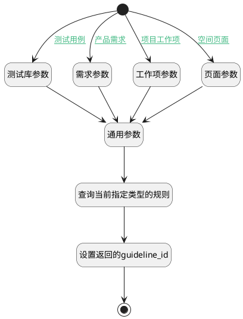

## 填充评审规则 <!-- {docsify-ignore-all} -->

   获取评审规则并返回

### 处理过程

### 处理步骤说明

#### 测试库参数 :id=PREPAREPARAM1 [准备参数]

1. 将`LIBRARY` 设置给  `guideline_filter(规则过滤器).N_OBJECT_TYPE_EQ`
2. 将`Default(传入变量).LIBRARY_ID(测试库标识)` 设置给  `guideline_filter(规则过滤器).N_SCOPE_ID_EQ`

#### 需求参数 :id=PREPAREPARAM3 [准备参数]

1. 将`PRODUCT` 设置给  `guideline_filter(规则过滤器).N_OBJECT_TYPE_EQ`
2. 将`Default(传入变量).PRINCIPAL_ID(评审主体标识)` 设置给  `guideline_filter(规则过滤器).N_SCOPE_ID_EQ`

#### 开始 :id=Begin [开始]

*- N/A*
#### 结束 :id=END1 [结束]

返回 `guideline_detail(规则详情)`

#### 通用参数 :id=PREPAREPARAM4 [准备参数]

1. 将`Default(传入变量).TYPE(评审类型)` 设置给  `guideline_filter(规则过滤器).N_SUBJECT_TYPE_EQ`

#### 查询当前指定类型的规则 :id=DEDATASET1 [实体数据集]

调用实体 [流程准则(GUIDELINE)](module/TestMgmt/guideline.md) 数据集合 [数据集(DEFAULT)](module/TestMgmt/guideline#数据集合) ，查询参数为`guideline_filter(规则过滤器)`

将执行结果返回给参数`guideline_page(规则分页结果)`

#### 设置返回的guideline_id :id=PREPAREPARAM2 [准备参数]

1. 将`guideline_page(规则分页结果).0` 绑定给  `guideline_detail(规则详情).guideline_id`
2. 将`guideline_detail(规则详情).REVIEW_STAGE(评审阶段)` 设置给  `guideline_detail(规则详情).stage`
3. 将`guideline_detail(规则详情).ID(标识)` 设置给  `guideline_detail(规则详情).guideline_id`

#### 工作项参数 :id=PREPAREPARAM5 [准备参数]

1. 将`PROJECT` 设置给  `guideline_filter(规则过滤器).N_OBJECT_TYPE_EQ`
2. 将`Default(传入变量).PRINCIPAL_ID(评审主体标识)` 设置给  `guideline_filter(规则过滤器).N_SCOPE_ID_EQ`

#### 页面参数 :id=PREPAREPARAM8 [准备参数]

1. 将`SPACE` 设置给  `guideline_filter(规则过滤器).N_OBJECT_TYPE_EQ`
2. 将`Default(传入变量).PRINCIPAL_ID(评审主体标识)` 设置给  `guideline_filter(规则过滤器).N_SCOPE_ID_EQ`

### 连接条件说明
#### 测试用例 :id=Begin-PREPAREPARAM1

`Default(传入变量).TYPE(评审类型)` EQ `TEST_CASE`
#### 产品需求 :id=Begin-PREPAREPARAM3

`Default(传入变量).TYPE(评审类型)` EQ `IDEA`
#### 项目工作项 :id=Begin-PREPAREPARAM5

`Default(传入变量).TYPE(评审类型)` EQ `WORK_ITEM`
#### 空间页面 :id=Begin-PREPAREPARAM8

`Default(传入变量).TYPE(评审类型)` EQ `PAGE`

### 实体逻辑参数

|    中文名   |    代码名    |  数据类型    |  实体   |备注 |
| --------| --------| -------- | -------- | --------   |
|传入变量(<i class="fa fa-check"/></i>)|Default|数据对象|[评审向导(REVIEW_WIZARD)](module/TestMgmt/review_wizard.md)||
|规则详情|guideline_detail|数据对象|[流程准则(GUIDELINE)](module/TestMgmt/guideline.md)||
|规则过滤器|guideline_filter|过滤器|||
|流程准则ID|guideline_id|数据对象|[流程准则(GUIDELINE)](module/TestMgmt/guideline.md)||
|规则分页结果|guideline_page|分页查询|||
