## 创建后修改附加数据归属 <!-- {docsify-ignore-all} -->

   创建后修改附加数据归属

### 处理过程

```plantuml
@startuml
hide empty description
<style>
root {
  HyperlinkColor #42b983
}
</style>

hide empty description
state "开始" as Begin <<start>> [[$./fix_nested_data#begin {"开始"}]]
state "创建后修改附加数据归属" as RAWSQLCALL1  [[$./fix_nested_data#rawsqlcall1 {"创建后修改附加数据归属"}]]


Begin --> RAWSQLCALL1


@enduml
```




### 处理步骤说明

#### 开始 :id=Begin<sup class="footnote-symbol"> <font color=gray size=1>[开始]</font></sup>


*- N/A*
#### 创建后修改附加数据归属 :id=RAWSQLCALL1<sup class="footnote-symbol"> <font color=gray size=1>[直接SQL调用]</font></sup>


<p class="panel-title"><b>执行sql语句</b></p>

```sql
update attention set OWNER_TYPE = 'REVIEW' where OWNER_TYPE ='REVIEW_WIZARD' AND OWNER_ID = ?

```

<p class="panel-title"><b>执行sql参数</b></p>

1. `Default(传入变量).ID(标识)`


### 实体逻辑参数

|    中文名   |    代码名    |  数据类型    |  实体   |备注 |
| --------| --------| -------- | -------- | --------   |
|传入变量(<i class="fa fa-check"/></i>)|Default|数据对象|[评审向导(REVIEW_WIZARD)](module/TestMgmt/review_wizard.md)||
