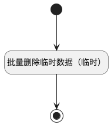

## 批量删除评审用例临时数据 <!-- {docsify-ignore-all} -->

   获取评审所有临时用例并删除

### 处理过程




### 处理步骤说明

#### 开始 :id=Begin<sup class="footnote-symbol"> <font color=gray size=1>[开始]</font></sup>


#### 结束 :id=END1<sup class="footnote-symbol"> <font color=gray size=1>[结束]</font></sup>


#### 批量删除临时数据（临时） :id=RAWJSCODE1<sup class="footnote-symbol"> <font color=gray size=1>[直接前台代码]</font></sup>


<p class="panel-title"><b>执行代码</b></p>

```javascript
return (async function() { 
    console.log('遍历临时数据删除')
    // 获取所有临时数据
    const serviceUtil = ibiz.hub.getApp(context.srfappid).deService;
    const service = await serviceUtil.getService(context, 'plmweb.review_content');
    const list = service.local.getList();
    // 遍历临时数据删除
    list.forEach(item => {
        service.local.delete(context, item.id);
    })
    const service2 = await serviceUtil.getService(context, 'plmweb.attention');
    const list2 = service2.local.getList();
    // 遍历临时数据删除
    list2.forEach(item => {
        service2.local.delete(context, item.id);
    })
    } 
)();

```


### 实体逻辑参数

|    中文名   |    代码名    |  数据类型      |备注 |
| --------| --------| --------  | --------   |
|view|view|当前视图对象||
|临时数据列表|list|数据对象列表||
|传入变量(<i class="fa fa-check"/></i>)|Default|数据对象||
