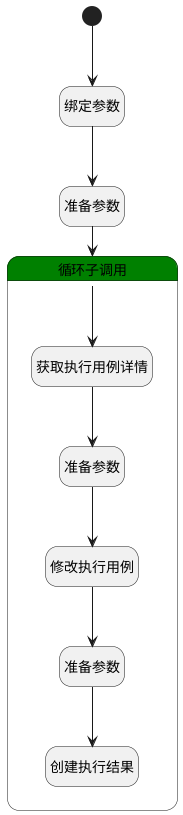

## 批设置执行结果 <!-- {docsify-ignore-all} -->

   批量设置执行用例的执行结果

### 处理过程

### 处理步骤说明

#### 开始 :id=Begin [开始]

*- N/A*
#### 绑定参数 :id=BINDPARAM1 [绑定参数]

绑定参数`Default(传入变量)` 到 `srfactionparam(选中数据对象)`
#### 准备参数 :id=PREPAREPARAM3 [准备参数]

1. 将`Default(传入变量).ID(标识)` 设置给  `ID(执行用例ID).ID(标识)`

#### 循环子调用 :id=LOOPSUBCALL1 [循环子调用]

循环参数`srfactionparam(选中数据对象)`，子循环参数使用`for_temp_obj(临时循环变量)`
#### 获取执行用例详情 :id=DEACTION1 [实体行为]

调用实体 [执行用例(RUN)](module/TestMgmt/run.md) 行为 [Get](module/TestMgmt/run#行为) ，行为参数为`ID(执行用例ID)`

将执行结果返回给参数`Default(传入变量)`

#### 准备参数 :id=PREPAREPARAM1 [准备参数]

1. 将`for_temp_obj(临时循环变量).STATUS(执行结果)` 设置给  `Default(传入变量).STATUS(执行结果)`

#### 修改执行用例 :id=DEACTION2 [实体行为]

调用实体 [执行用例(RUN)](module/TestMgmt/run.md) 行为 [Update](module/TestMgmt/run#行为) ，行为参数为`Default(传入变量)`

#### 准备参数 :id=PREPAREPARAM2 [准备参数]

1. 将`Default(传入变量)` 拷贝到  `run_history(执行结果)`
2. 将`空值（NULL）` 设置给  `run_history(执行结果).ID(标识)`
3. 将`Default(传入变量).ID(标识)` 设置给  `run_history(执行结果).RUN_ID(执行用例标识)`

#### 创建执行结果 :id=DEACTION3 [实体行为]

调用实体 [执行结果(RUN_HISTORY)](module/TestMgmt/run_history.md) 行为 [Create](module/TestMgmt/run_history#行为) ，行为参数为`run_history(执行结果)`

### 实体逻辑参数

|    中文名   |    代码名    |  数据类型    |  实体   |备注 |
| --------| --------| -------- | -------- | --------   |
|传入变量(<i class="fa fa-check"/></i>)|Default|数据对象|[执行用例(RUN)](module/TestMgmt/run.md)||
|执行用例ID|ID|数据对象|[执行用例(RUN)](module/TestMgmt/run.md)||
|临时循环变量|for_temp_obj|数据对象|[执行用例(RUN)](module/TestMgmt/run.md)||
|执行结果|run_history|数据对象|[执行结果(RUN_HISTORY)](module/TestMgmt/run_history.md)||
|选中数据对象|srfactionparam|数据对象列表|[执行用例(RUN)](module/TestMgmt/run.md)||
