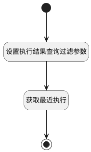

## 测试用例最新执行结果 <!-- {docsify-ignore-all} -->

   测试用例最新执行结果

### 处理过程

### 处理步骤说明

#### 开始 :id=Begin [开始]

*- N/A*
#### 设置执行结果查询过滤参数 :id=PREPAREPARAM1 [准备参数]

1. 将`1` 设置给  `Default(传入变量).size`
2. 将`executed_at,desc` 设置给  `Default(传入变量).sort`
3. 将`1` 设置给  `Default(传入变量).N_STATUS_ISNOTNULL`

#### 获取最近执行 :id=DEDATASET1 [实体数据集]

调用实体 [执行用例(RUN)](module/TestMgmt/run.md) 数据集合 [数据集(DEFAULT)](module/TestMgmt/run#数据集合) ，查询参数为`Default(传入变量)`

将执行结果返回给参数`page`

#### 结束 :id=END1 [结束]

返回 `page`

### 实体逻辑参数

|    中文名   |    代码名    |  数据类型    |  实体   |备注 |
| --------| --------| -------- | -------- | --------   |
|传入变量(<i class="fa fa-check"/></i>)|Default|过滤器|||
|page|page|分页查询|||
