## 添加计划执行用例 <!-- {docsify-ignore-all} -->

   将测试计划主键置空并生成执行用例

### 处理过程

```plantuml
@startuml
hide empty description
<style>
root {
  HyperlinkColor #42b983
}
</style>

hide empty description
state "开始" as Begin <<start>> [[$./create_plan_run#begin {"开始"}]]
state "主键置空" as PREPAREPARAM1  [[$./create_plan_run#prepareparam1 {"主键置空"}]]
state "附加到数组参数" as APPENDPARAM1  [[$./create_plan_run#appendparam1 {"附加到数组参数"}]]
state "执行Create" as DEACTION1  [[$./create_plan_run#deaction1 {"执行Create"}]]
state "结束" as END1 <<end>> [[$./create_plan_run#end1 {"结束"}]]


Begin --> PREPAREPARAM1
PREPAREPARAM1 --> APPENDPARAM1
APPENDPARAM1 --> DEACTION1
DEACTION1 --> END1


@enduml
```

### 处理步骤说明

#### 开始 :id=Begin [开始]

*- N/A*
#### 主键置空 :id=PREPAREPARAM1 [准备参数]

1. 将`空值（NULL）` 设置给  `Default(传入变量).ID(标识)`

#### 附加到数组参数 :id=APPENDPARAM1 [附加到数组参数]

将参数`Default(传入变量)` 添加到数组参数`runarray(run数组)`
#### 执行Create :id=DEACTION1 [实体行为]

调用实体 [执行用例(RUN)](module/TestMgmt/run.md) 行为 [Create](module/TestMgmt/run#行为) ，行为参数为`runarray(run数组)`

#### 结束 :id=END1 [结束]

*- N/A*

### 实体逻辑参数

|    中文名   |    代码名    |  数据类型    |  实体   |备注 |
| --------| --------| -------- | -------- | --------   |
|传入变量(<i class="fa fa-check"/></i>)|Default|数据对象|[执行用例(RUN)](module/TestMgmt/run.md)||
|run数组|runarray|数据对象列表|[执行用例(RUN)](module/TestMgmt/run.md)||
