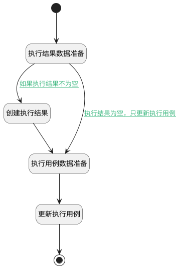

## 记录执行结果 <!-- {docsify-ignore-all} -->

   记录当前执行用例的执行结果

### 处理过程

### 处理步骤说明

#### 创建执行结果 :id=DEACTION6 [实体行为]

调用实体 [执行结果(RUN_HISTORY)](module/TestMgmt/run_history.md) 行为 [Create](module/TestMgmt/run_history#行为) ，行为参数为`run_history(执行历史)`

将执行结果返回给参数`run_history(执行历史)`

#### 开始 :id=Begin [开始]

*- N/A*
#### 结束 :id=END3 [结束]

*- N/A*

#### 执行结果数据准备 :id=PREPAREPARAM5 [准备参数]

1. 将`Default(传入变量)` 拷贝到  `run_history(执行历史)`
2. 将`Default(传入变量).REMARK(备注)` 设置给  `run_history(执行历史).REMARK(备注)`
3. 将`用户全局对象.srfpersonid` 设置给  `run_history(执行历史).EXECUTOR_ID(执行人标识)`
4. 将`Default(传入变量).ID(标识)` 设置给  `temp_obj(临时变量).ID(标识)`
5. 将`空值（NULL）` 设置给  `run_history(执行历史).EXECUTED_AT(执行时间)`
6. 将`Default(传入变量).ID(标识)` 设置给  `run_history(执行历史).RUN_ID(执行用例标识)`
7. 将`空值（NULL）` 设置给  `run_history(执行历史).ID(标识)`
8. 将`Default(传入变量).STEPS(步骤)` 设置给  `run_history(执行历史).STEPS(步骤)`

#### 执行用例数据准备 :id=PREPAREPARAM6 [准备参数]

1. 将`run_history(执行历史).EXECUTED_AT(执行时间)` 设置给  `temp_obj(临时变量).EXECUTED_AT(执行时间)`
2. 将`Default(传入变量).ATTACHMENTS` 设置给  `temp_obj(临时变量).ATTACHMENTS`
3. 将`run_history(执行历史).STEPS(步骤)` 设置给  `temp_obj(临时变量).STEPS(步骤)`
4. 将`run_history(执行历史).STATUS(执行结果)` 设置给  `temp_obj(临时变量).STATUS(执行结果)`
5. 将`run_history(执行历史).RUN_ID(执行用例标识)` 设置给  `temp_obj(临时变量).ID(标识)`
6. 将`run_history(执行历史).EXECUTOR_NAME(执行人)` 设置给  `temp_obj(临时变量).EXECUTOR_NAME(执行人)`

#### 更新执行用例 :id=DEACTION7 [实体行为]

调用实体 [执行用例(RUN)](module/TestMgmt/run.md) 行为 [Update](module/TestMgmt/run#行为) ，行为参数为`temp_obj(临时变量)`

### 连接条件说明
#### 如果执行结果不为空 :id=PREPAREPARAM5-DEACTION6

`Default(传入变量).STATUS(执行结果)` ISNOTNULL
#### 执行结果为空，只更新执行用例 :id=PREPAREPARAM5-PREPAREPARAM6

`Default(传入变量).STATUS(执行结果)` ISNULL

### 实体逻辑参数

|    中文名   |    代码名    |  数据类型    |  实体   |备注 |
| --------| --------| -------- | -------- | --------   |
|传入变量(<i class="fa fa-check"/></i>)|Default|数据对象|[执行用例(RUN)](module/TestMgmt/run.md)||
|要更改的ID|id|简单数据|||
|选中的数据ID|ids|简单数据列表|||
|执行历史|run_history|数据对象|[执行结果(RUN_HISTORY)](module/TestMgmt/run_history.md)||
|steps|steps|数据对象|[执行结果(RUN_HISTORY)](module/TestMgmt/run_history.md)||
|临时变量|temp_obj|数据对象|[执行用例(RUN)](module/TestMgmt/run.md)||
