## 记录执行结果 <!-- {docsify-ignore-all} -->

   记录当前执行用例的执行结果

### 处理过程

```plantuml
@startuml
hide empty description
<style>
root {
  HyperlinkColor #42b983
}
</style>

hide empty description
state "开始" as Begin <<start>> [[$./create_result#begin {"开始"}]]
state "设置执行人相关信息" as PREPAREPARAM3  [[$./create_result#prepareparam3 {"设置执行人相关信息"}]]
state "调试逻辑参数" as DEBUGPARAM2  [[$./create_result#debugparam2 {"调试逻辑参数"}]]
state "执行结果数据准备" as PREPAREPARAM5  [[$./create_result#prepareparam5 {"执行结果数据准备"}]]
state "创建执行结果" as DEACTION6  [[$./create_result#deaction6 {"创建执行结果"}]]
state "实体数据集" as DEDATASET2  [[$./create_result#dedataset2 {"实体数据集"}]]
state "结束" as END2 <<end>> [[$./create_result#end2 {"结束"}]]
state "反向关联" as DEACTION8  [[$./create_result#deaction8 {"反向关联"}]]
state "正向关联" as DEACTION5  [[$./create_result#deaction5 {"正向关联"}]]
state "准备关联数据" as PREPAREPARAM9  [[$./create_result#prepareparam9 {"准备关联数据"}]]
state "创建工作项" as DEACTION4  [[$./create_result#deaction4 {"创建工作项"}]]
state "准备参数" as PREPAREPARAM12  [[$./create_result#prepareparam12 {"准备参数"}]]
state "执行用例数据准备" as PREPAREPARAM6  [[$./create_result#prepareparam6 {"执行用例数据准备"}]]
state "获取测试计划" as DEACTION3  [[$./create_result#deaction3 {"获取测试计划"}]]
state "拼接描述字段" as RAWSFCODE1  [[$./create_result#rawsfcode1 {"拼接描述字段"}]]
state "准备参数" as PREPAREPARAM7  [[$./create_result#prepareparam7 {"准备参数"}]]
state "工作项类型数据集" as DEDATASET1  [[$./create_result#dedataset1 {"工作项类型数据集"}]]
state "准备系统参数" as PREPAREPARAM13  [[$./create_result#prepareparam13 {"准备系统参数"}]]
state "循环子调用" as LOOPSUBCALL3  [[$./create_result#loopsubcall3 {"循环子调用"}]] #green {
state "更新执行用例" as DEACTION7  [[$./create_result#deaction7 {"更新执行用例"}]]
state "准备参数" as PREPAREPARAM4  [[$./create_result#prepareparam4 {"准备参数"}]]
state "获取测试用例" as DEACTION9  [[$./create_result#deaction9 {"获取测试用例"}]]
state "绑定用例附件" as PREPAREPARAM10  [[$./create_result#prepareparam10 {"绑定用例附件"}]]
}
state "循环子调用" as LOOPSUBCALL2  [[$./create_result#loopsubcall2 {"循环子调用"}]] #green {
state "准备参数" as PREPAREPARAM11  [[$./create_result#prepareparam11 {"准备参数"}]]
}
state "循环子调用" as LOOPSUBCALL1  [[$./create_result#loopsubcall1 {"循环子调用"}]] #green {
state "准备参数" as PREPAREPARAM8  [[$./create_result#prepareparam8 {"准备参数"}]]
}


Begin --> DEBUGPARAM2
DEBUGPARAM2 --> PREPAREPARAM3 : [[$./create_result#debugparam2-prepareparam3{连接名称} 连接名称]]
PREPAREPARAM3 --> PREPAREPARAM5
PREPAREPARAM5 --> DEACTION6 : [[$./create_result#prepareparam5-deaction6{如果执行结果不为空} 如果执行结果不为空]]
DEACTION6 --> PREPAREPARAM6
PREPAREPARAM6 --> PREPAREPARAM13
PREPAREPARAM13 --> DEDATASET2
DEDATASET2 --> LOOPSUBCALL3
LOOPSUBCALL3 --> DEACTION7
DEACTION7 --> END2 : [[$./create_result#deaction7-end2{连接名称} 连接名称]]
DEACTION7 --> PREPAREPARAM4 : [[$./create_result#deaction7-prepareparam4{执行失败创建用例} 执行失败创建用例]]
PREPAREPARAM4 --> DEACTION9
DEACTION9 --> PREPAREPARAM10
PREPAREPARAM10 --> LOOPSUBCALL2
LOOPSUBCALL2 --> PREPAREPARAM11
LOOPSUBCALL2 --> PREPAREPARAM12
PREPAREPARAM12 --> DEACTION3
DEACTION3 --> PREPAREPARAM7 : [[$./create_result#deaction3-prepareparam7{连接名称} 连接名称]]
PREPAREPARAM7 --> DEDATASET1
DEDATASET1 --> LOOPSUBCALL1
LOOPSUBCALL1 --> RAWSFCODE1
RAWSFCODE1 --> DEACTION4
DEACTION4 --> PREPAREPARAM9
PREPAREPARAM9 --> DEACTION5
DEACTION5 --> DEACTION8
DEACTION8 --> END2
LOOPSUBCALL1 --> PREPAREPARAM8 : [[$./create_result#loopsubcall1-prepareparam8{连接名称} 连接名称]]
DEACTION3 --> END2 : [[$./create_result#deaction3-end2{连接名称} 连接名称]]
PREPAREPARAM5 --> PREPAREPARAM6 : [[$./create_result#prepareparam5-prepareparam6{执行结果为空，只更新执行用例} 执行结果为空，只更新执行用例]]
DEBUGPARAM2 --> PREPAREPARAM5 : [[$./create_result#debugparam2-prepareparam5{连接名称} 连接名称]]


@enduml
```




### 处理步骤说明

#### 开始 :id=Begin<sup class="footnote-symbol"> <font color=gray size=1>[开始]</font></sup>


*- N/A*
#### 调试逻辑参数 :id=DEBUGPARAM2<sup class="footnote-symbol"> <font color=gray size=1>[调试逻辑参数]</font></sup>


> [!NOTE|label:调试信息|icon:fa fa-bug]
> 调试输出参数`Default(传入变量)`的详细信息


#### 创建执行结果 :id=DEACTION6<sup class="footnote-symbol"> <font color=gray size=1>[实体行为]</font></sup>


调用实体 [执行结果(RUN_HISTORY)](module/TestMgmt/run_history.md) 行为 [Create](module/TestMgmt/run_history#行为) ，行为参数为`run_history(执行历史)`

将执行结果返回给参数`run_history(执行历史)`

#### 准备系统参数 :id=PREPAREPARAM13<sup class="footnote-symbol"> <font color=gray size=1>[准备参数]</font></sup>


1. 将`Default(传入变量).LIBRARY_ID(测试库标识)` 设置给  `parameter_filter(参数过滤器).N_OWNER_ID_EQ`
2. 将`LIBRARY` 设置给  `parameter_filter(参数过滤器).N_OWNER_TYPE_EQ`
3. 将`RUNFAILURE` 设置给  `parameter_filter(参数过滤器).N_OWNER_SUBTYPE_EQ`

#### 设置执行人相关信息 :id=PREPAREPARAM3<sup class="footnote-symbol"> <font color=gray size=1>[准备参数]</font></sup>


1. 将`用户全局对象.srfpersonid` 设置给  `run_history(执行历史).EXECUTOR_ID(执行人标识)`
2. 将`用户全局对象.srfpersonname` 设置给  `run_history(执行历史).EXECUTOR_NAME(执行人)`
3. 将`用户全局对象.srfpersonname` 设置给  `temp_obj(临时变量).EXECUTOR_NAME(执行人)`
4. 将`用户全局对象.srfpersonid` 设置给  `temp_obj(临时变量).EXECUTOR_ID(执行人标识)`

#### 执行结果数据准备 :id=PREPAREPARAM5<sup class="footnote-symbol"> <font color=gray size=1>[准备参数]</font></sup>


1. 将`Default(传入变量)` 拷贝到  `run_history(执行历史)`
2. 将`Default(传入变量).REMARK(备注)` 设置给  `run_history(执行历史).REMARK(备注)`
3. 将`Default(传入变量).ID(标识)` 设置给  `temp_obj(临时变量).ID(标识)`
4. 将`空值（NULL）` 设置给  `run_history(执行历史).EXECUTED_AT(执行时间)`
5. 将`Default(传入变量).ID(标识)` 设置给  `run_history(执行历史).RUN_ID(执行用例标识)`
6. 将`空值（NULL）` 设置给  `run_history(执行历史).ID(标识)`
7. 将`Default(传入变量).STEPS(步骤)` 设置给  `run_history(执行历史).STEPS(步骤)`

#### 执行用例数据准备 :id=PREPAREPARAM6<sup class="footnote-symbol"> <font color=gray size=1>[准备参数]</font></sup>


1. 将`run_history(执行历史).EXECUTED_AT(执行时间)` 设置给  `temp_obj(临时变量).EXECUTED_AT(执行时间)`
2. 将`Default(传入变量).ATTACHMENTS` 设置给  `temp_obj(临时变量).ATTACHMENTS`
3. 将`run_history(执行历史).STEPS(步骤)` 设置给  `temp_obj(临时变量).STEPS(步骤)`
4. 将`run_history(执行历史).STATUS(执行结果)` 设置给  `temp_obj(临时变量).STATUS(执行结果)`
5. 将`run_history(执行历史).RUN_ID(执行用例标识)` 设置给  `temp_obj(临时变量).ID(标识)`
6. 将`run_history(执行历史).EXECUTOR_NAME(执行人)` 设置给  `temp_obj(临时变量).EXECUTOR_NAME(执行人)`

#### 实体数据集 :id=DEDATASET2<sup class="footnote-symbol"> <font color=gray size=1>[实体数据集]</font></sup>


调用实体 [系统参数(PARAMETER)](module/Base/parameter.md) 数据集合 [数据集(DEFAULT)](module/Base/parameter#数据集合) ，查询参数为`parameter_filter(参数过滤器)`

将执行结果返回给参数`parameter_page(参数分页数据)`

#### 循环子调用 :id=LOOPSUBCALL3<sup class="footnote-symbol"> <font color=gray size=1>[循环子调用]</font></sup>


循环参数`parameter_page(参数分页数据)`，子循环参数使用`parameter(系统参数)`
#### 结束 :id=END2<sup class="footnote-symbol"> <font color=gray size=1>[结束]</font></sup>


*- N/A*

#### 更新执行用例 :id=DEACTION7<sup class="footnote-symbol"> <font color=gray size=1>[实体行为]</font></sup>


调用实体 [执行用例(RUN)](module/TestMgmt/run.md) 行为 [Update](module/TestMgmt/run#行为) ，行为参数为`temp_obj(临时变量)`

#### 反向关联 :id=DEACTION8<sup class="footnote-symbol"> <font color=gray size=1>[实体行为]</font></sup>


调用实体 [关联(RELATION)](module/Base/relation.md) 行为 [Create](module/Base/relation#行为) ，行为参数为`relation2(反向关联)`

#### 正向关联 :id=DEACTION5<sup class="footnote-symbol"> <font color=gray size=1>[实体行为]</font></sup>


调用实体 [关联(RELATION)](module/Base/relation.md) 行为 [Create](module/Base/relation#行为) ，行为参数为`relation(正向关联)`

#### 准备参数 :id=PREPAREPARAM4<sup class="footnote-symbol"> <font color=gray size=1>[准备参数]</font></sup>


1. 将`Default(传入变量).TITLE(标题)` 设置给  `work_item(工作项).TITLE(标题)`
2. 将`Default(传入变量).CASE_ID(测试用例标识)` 设置给  `test_case(测试用例).ID(标识)`
3. 将`bug` 设置给  `work_item_type_filter(工作项类型过滤器).n_group_eq`
4. 将`Default(传入变量).PRIORITY(优先级)` 设置给  `work_item(工作项).PRIORITY(优先级)`
5. 将`Default(传入变量).ATTENTIONS(关注)` 设置给  `work_item(工作项).ATTENTIONS(关注)`
6. 将`Default(传入变量).PLAN_ID(测试计划标识)` 设置给  `test_plan(测试计划).ID(标识)`

#### 准备关联数据 :id=PREPAREPARAM9<sup class="footnote-symbol"> <font color=gray size=1>[准备参数]</font></sup>


1. 将`run` 设置给  `relation(正向关联).PRINCIPAL_TYPE(关联主体类型)`
2. 将`work_item` 设置给  `relation2(反向关联).PRINCIPAL_TYPE(关联主体类型)`
3. 将`run` 设置给  `relation2(反向关联).TARGET_TYPE(关联目标类型)`
4. 将`Default(传入变量).ID(标识)` 设置给  `relation2(反向关联).TARGET_ID(目标主体标识)`
5. 将`work_item(工作项).ID(标识)` 设置给  `relation2(反向关联).PRINCIPAL_ID(关联主体标识)`
6. 将`Default(传入变量).ID(标识)` 设置给  `relation(正向关联).PRINCIPAL_ID(关联主体标识)`
7. 将`work_item(工作项).ID(标识)` 设置给  `relation(正向关联).TARGET_ID(目标主体标识)`
8. 将`work_item` 设置给  `relation(正向关联).TARGET_TYPE(关联目标类型)`

#### 获取测试用例 :id=DEACTION9<sup class="footnote-symbol"> <font color=gray size=1>[实体行为]</font></sup>


调用实体 [用例(TEST_CASE)](module/TestMgmt/test_case.md) 行为 [Get](module/TestMgmt/test_case#行为) ，行为参数为`test_case(测试用例)`

将执行结果返回给参数`test_case(测试用例)`

#### 创建工作项 :id=DEACTION4<sup class="footnote-symbol"> <font color=gray size=1>[实体行为]</font></sup>


调用实体 [工作项(WORK_ITEM)](module/ProjMgmt/work_item.md) 行为 [Create](module/ProjMgmt/work_item#行为) ，行为参数为`work_item(工作项)`

将执行结果返回给参数`work_item(工作项)`

#### 绑定用例附件 :id=PREPAREPARAM10<sup class="footnote-symbol"> <font color=gray size=1>[准备参数]</font></sup>


1. 将`test_case(测试用例).ATTACHMENTS(附件)` 绑定给  `attachments(附件)`

#### 准备参数 :id=PREPAREPARAM12<sup class="footnote-symbol"> <font color=gray size=1>[准备参数]</font></sup>


1. 将`attachments(附件)` 设置给  `work_item(工作项).ATTACHMENTS(附件)`

#### 获取测试计划 :id=DEACTION3<sup class="footnote-symbol"> <font color=gray size=1>[实体行为]</font></sup>


调用实体 [测试计划(TEST_PLAN)](module/TestMgmt/test_plan.md) 行为 [Get](module/TestMgmt/test_plan#行为) ，行为参数为`test_plan(测试计划)`

将执行结果返回给参数`test_plan(测试计划)`

#### 拼接描述字段 :id=RAWSFCODE1<sup class="footnote-symbol"> <font color=gray size=1>[直接后台代码]</font></sup>


<p class="panel-title"><b>执行代码[Groovy]</b></p>

```groovy
def _default = logic.param('Default').getReal();
def work_item = logic.param('work_item').getReal();

//获取代码表
def run_status = sys.codelist('TestMgmt__run_status');


def table_start = '<table style="width: auto;"><tbody><tr><th colSpan="1" rowSpan="1" width="56.32">#</th><th colSpan="1" rowSpan="1" width="auto">步骤描述</th><th colSpan="1" rowSpan="1" width="auto">预期结果</th><th colSpan="1" rowSpan="1" width="auto">实际结果</th><th colSpan="1" rowSpan="1" width="80">执行结果</th></tr>';
def table_end = '</tbody></table>';
def steps = _default.get('steps');
def text = '<p><strong>前置条件：</strong></p>' + (_default.get('precondition') ?: '') + '<p><strong>执行步骤：</strong></p>' + table_start;


def content = '<td colSpan="1" rowSpan="1" width="auto">';
def group = '<td colSpan="4" rowSpan="1" width="auto">';

def order = 1;
def group_order = 0.1;
steps.each { item ->
    println item;
    if(item.get('is_group') == 0){
        text += '<tr>' + content + order + '</td>';
        text += content;
        text += (item.get('description') ?: '') + '</td>';
        text += content;
        text += (item.get('expected_value') ?: '') + '</td>'
        text += content;
        text += (item.get('actual_value') ?: '') + '</td>';
        text += content;
        text += (run_status.getText(item.get('status1'))) ?: '' + '</td>' + '</tr>';
    }else if(item.get('is_group') == 1){
        text += '<tr>' + content + order + '</td>';
        text += group;
        text += (item.get('name') ?: '') + '</td>' + '</tr>';
        group_order = 0.1;
    }else{
        group_order += order;
        text += '<tr>' + content + group_order + '</td>';
        text += content;
        text += (item.get('description') ?: '') + '</td>';
        text += content;
        text += (item.get('expected_value') ?: '') + '</td>'
        text += content;
        text += (item.get('actual_value') ?: '') + '</td>';
        text += content;
        text += (run_status.getText(item.get('status1'))) ?: '' + '</td>' + '</tr>';
        group_order += 0.1;
    }
    order++;
}
text +=table_end;

work_item.set('description', text);
```

#### 循环子调用 :id=LOOPSUBCALL2<sup class="footnote-symbol"> <font color=gray size=1>[循环子调用]</font></sup>


循环参数`attachments(附件)`，子循环参数使用`attachment_temp(附件临时变量)`
#### 准备参数 :id=PREPAREPARAM7<sup class="footnote-symbol"> <font color=gray size=1>[准备参数]</font></sup>


1. 将`test_plan(测试计划).PROJECT_ID(关联项目)` 设置给  `work_item(工作项).PROJECT_ID(项目)`
2. 将`test_plan(测试计划).PROJECT_TYPE(项目类型)` 设置给  `work_item_type_filter(工作项类型过滤器).N_PROJECT_TYPE_EQ`

#### 工作项类型数据集 :id=DEDATASET1<sup class="footnote-symbol"> <font color=gray size=1>[实体数据集]</font></sup>


调用实体 [工作项类型(WORK_ITEM_TYPE)](module/ProjMgmt/work_item_type.md) 数据集合 [数据集(DEFAULT)](module/ProjMgmt/work_item_type#数据集合) ，查询参数为`work_item_type_filter(工作项类型过滤器)`

将执行结果返回给参数`work_item_type_page(工作项分页结果)`

#### 循环子调用 :id=LOOPSUBCALL1<sup class="footnote-symbol"> <font color=gray size=1>[循环子调用]</font></sup>


循环参数`work_item_type_page(工作项分页结果)`，子循环参数使用`work_item_type_temp(工作性类型临时变量)`
#### 准备参数 :id=PREPAREPARAM11<sup class="footnote-symbol"> <font color=gray size=1>[准备参数]</font></sup>


1. 将`空值（NULL）` 设置给  `attachment_temp(附件临时变量).owner_id`
2. 将`空值（NULL）` 设置给  `attachment_temp(附件临时变量).owner_type`
3. 将`空值（NULL）` 设置给  `attachment_temp(附件临时变量).id`

#### 准备参数 :id=PREPAREPARAM8<sup class="footnote-symbol"> <font color=gray size=1>[准备参数]</font></sup>


1. 将`work_item_type_temp(工作性类型临时变量).ID(标识)` 设置给  `work_item(工作项).WORK_ITEM_TYPE_ID(工作项类型)`


### 连接条件说明
#### 连接名称 :id=DEBUGPARAM2-PREPAREPARAM3

`Default(传入变量).EXECUTOR_ID(执行人标识)` ISNULL
#### 如果执行结果不为空 :id=PREPAREPARAM5-DEACTION6

`Default(传入变量).STATUS(执行结果)` ISNOTNULL
#### 连接名称 :id=DEACTION7-END2

`parameter(系统参数).VAL(值)` EQ `0`
#### 执行失败创建用例 :id=DEACTION7-PREPAREPARAM4

`Default(传入变量).STATUS(执行结果)` EQ `30` AND `parameter(系统参数).VAL(值)` EQ `1`
#### 连接名称 :id=DEACTION3-PREPAREPARAM7

`test_plan(测试计划).PROJECT_ID(关联项目)` ISNOTNULL
#### 连接名称 :id=LOOPSUBCALL1-PREPAREPARAM8

`work_item_type_temp(工作性类型临时变量).ORGIN_STATE(原始状态)` EQ `bug`
#### 连接名称 :id=DEACTION3-END2

`test_plan(测试计划).PROJECT_ID(关联项目)` ISNULL
#### 执行结果为空，只更新执行用例 :id=PREPAREPARAM5-PREPAREPARAM6

`Default(传入变量).STATUS(执行结果)` ISNULL
#### 连接名称 :id=DEBUGPARAM2-PREPAREPARAM5

`Default(传入变量).EXECUTOR_ID(执行人标识)` ISNOTNULL


### 实体逻辑参数

|    中文名   |    代码名    |  数据类型    |  实体   |备注 |
| --------| --------| -------- | -------- | --------   |
|传入变量(<i class="fa fa-check"/></i>)|Default|数据对象|[执行用例(RUN)](module/TestMgmt/run.md)||
|附件临时变量|attachment_temp|数据对象|||
|附件|attachments|数据对象列表|||
|要更改的ID|id|简单数据|||
|选中的数据ID|ids|简单数据列表|||
|系统参数|parameter|数据对象|[系统参数(PARAMETER)](module/Base/parameter.md)||
|参数过滤器|parameter_filter|过滤器|||
|参数分页数据|parameter_page|分页查询|||
|正向关联|relation|数据对象|[关联(RELATION)](module/Base/relation.md)||
|反向关联|relation2|数据对象|[关联(RELATION)](module/Base/relation.md)||
|执行历史|run_history|数据对象|[执行结果(RUN_HISTORY)](module/TestMgmt/run_history.md)||
|steps|steps|数据对象|[执行结果(RUN_HISTORY)](module/TestMgmt/run_history.md)||
|临时变量|temp_obj|数据对象|[执行用例(RUN)](module/TestMgmt/run.md)||
|测试用例|test_case|数据对象|[用例(TEST_CASE)](module/TestMgmt/test_case.md)||
|测试计划|test_plan|数据对象|[测试计划(TEST_PLAN)](module/TestMgmt/test_plan.md)||
|工作项|work_item|数据对象|[工作项(WORK_ITEM)](module/ProjMgmt/work_item.md)||
|工作项类型|work_item_type|数据对象|[工作项类型(WORK_ITEM_TYPE)](module/ProjMgmt/work_item_type.md)||
|工作项类型过滤器|work_item_type_filter|过滤器|||
|工作项分页结果|work_item_type_page|分页查询|||
|工作性类型临时变量|work_item_type_temp|数据对象|[工作项类型(WORK_ITEM_TYPE)](module/ProjMgmt/work_item_type.md)||
