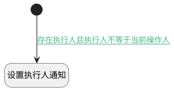

## 执行人变更附加逻辑 <!-- {docsify-ignore-all} -->

   执行用例执行人变更时触发相应的通知消息

### 处理过程

### 处理步骤说明

#### 开始 :id=Begin [开始]

*- N/A*
#### 设置执行人通知 :id=DENOTIFY1 [实体通知]

调用实体 [执行用例(RUN)](module/TestMgmt/run.md) 通知 [执行用例设置执行人通知(executor_notify)](module/TestMgmt/run/notify/executor_notify) ，参数为`Default(传入变量)`

### 连接条件说明
#### 存在执行人且执行人不等于当前操作人 :id=Begin-DENOTIFY1

`Default(传入变量).EXECUTOR_ID(执行人标识)` ISNOTNULL AND 

### 实体逻辑参数

|    中文名   |    代码名    |  数据类型    |  实体   |备注 |
| --------| --------| -------- | -------- | --------   |
|传入变量(<i class="fa fa-check"/></i>)|Default|数据对象|[执行用例(RUN)](module/TestMgmt/run.md)||
