## 获取实际工时 <!-- {docsify-ignore-all} -->

   获取用例的实际工时

### 处理过程

```plantuml
@startuml
hide empty description
<style>
root {
  HyperlinkColor #42b983
}
</style>

hide empty description
state "开始" as Begin <<start>> [[$./get_actual_workload#begin {"开始"}]]
state "获取执行用例" as DEACTION1  [[$./get_actual_workload#deaction1 {"获取执行用例"}]]
state "获取已登记的工时" as RAWSQLCALL1  [[$./get_actual_workload#rawsqlcall1 {"获取已登记的工时"}]]
state "获取剩余工时" as RAWSQLCALL2  [[$./get_actual_workload#rawsqlcall2 {"获取剩余工时"}]]
state "获取预估工时" as RAWSQLCALL3  [[$./get_actual_workload#rawsqlcall3 {"获取预估工时"}]]
state "结束" as END1 <<end>> [[$./get_actual_workload#end1 {"结束"}]]


Begin --> DEACTION1
DEACTION1 --> RAWSQLCALL1
RAWSQLCALL1 --> RAWSQLCALL2
RAWSQLCALL2 --> RAWSQLCALL3
RAWSQLCALL3 --> END1


@enduml
```




### 处理步骤说明

#### 开始 :id=Begin<sup class="footnote-symbol"> <font color=gray size=1>[开始]</font></sup>


*- N/A*
#### 获取执行用例 :id=DEACTION1<sup class="footnote-symbol"> <font color=gray size=1>[实体行为]</font></sup>


调用实体 [执行用例(RUN)](module/TestMgmt/run.md) 行为 [Get](module/TestMgmt/run#行为) ，行为参数为`Default(传入变量)`

将执行结果返回给参数`Default(传入变量)`

#### 获取已登记的工时 :id=RAWSQLCALL1<sup class="footnote-symbol"> <font color=gray size=1>[直接SQL调用]</font></sup>


<p class="panel-title"><b>执行sql语句</b></p>

```sql
select sum(DURATION) as `ACTUAL_WORKLOAD` from `workload` where  PRINCIPAL_TYPE = 'TEST_CASE' and PRINCIPAL_ID = ?
```

<p class="panel-title"><b>执行sql参数</b></p>

1. `Default(传入变量).CASE_ID(测试用例标识)`

重置参数`Default(传入变量)`，并将执行sql结果赋值给参数`Default(传入变量)`

#### 获取剩余工时 :id=RAWSQLCALL2<sup class="footnote-symbol"> <font color=gray size=1>[直接SQL调用]</font></sup>


<p class="panel-title"><b>执行sql语句</b></p>

```sql
select DECIMAL_VALUE as REMAINING_WORKLOAD  from extend_storage where owner_id = ? and owner_type = 'TEST_CASE' and `name` = 'REMAINING_WORKLOAD'
```

<p class="panel-title"><b>执行sql参数</b></p>

1. `Default(传入变量).CASE_ID(测试用例标识)`

重置参数`Default(传入变量)`，并将执行sql结果赋值给参数`Default(传入变量)`

#### 获取预估工时 :id=RAWSQLCALL3<sup class="footnote-symbol"> <font color=gray size=1>[直接SQL调用]</font></sup>


<p class="panel-title"><b>执行sql语句</b></p>

```sql
select DECIMAL_VALUE as ESTIMATED_WORKLOAD  from extend_storage where owner_id = ? and owner_type = 'TEST_CASE' and `name` = 'ESTIMATED_WORKLOAD'
```

<p class="panel-title"><b>执行sql参数</b></p>

1. `Default(传入变量).CASE_ID(测试用例标识)`

重置参数`Default(传入变量)`，并将执行sql结果赋值给参数`Default(传入变量)`

#### 结束 :id=END1<sup class="footnote-symbol"> <font color=gray size=1>[结束]</font></sup>


返回 `Default(传入变量)`


### 实体逻辑参数

|    中文名   |    代码名    |  数据类型    |  实体   |备注 |
| --------| --------| -------- | -------- | --------   |
|传入变量(<i class="fa fa-check"/></i>)|Default|数据对象|[执行用例(RUN)](module/TestMgmt/run.md)||
