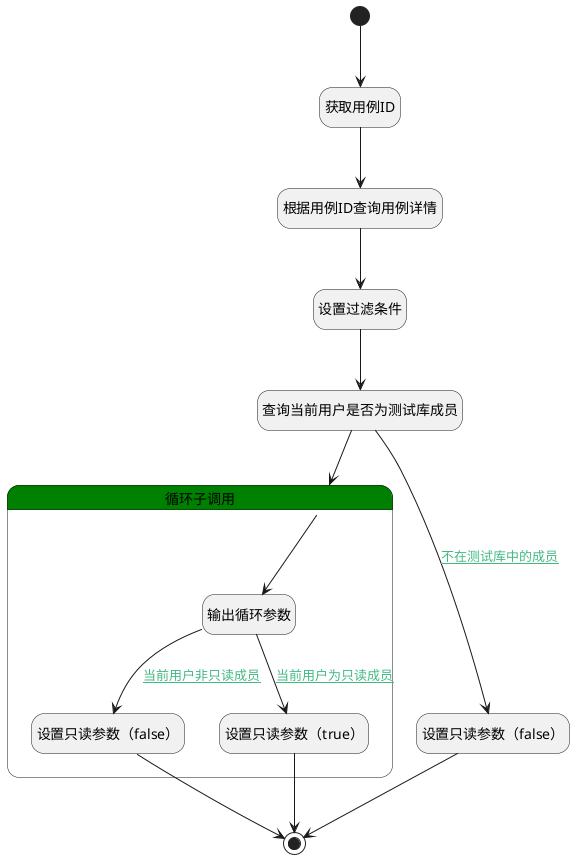

## 获取测试库成员 <!-- {docsify-ignore-all} -->

   获取测试库成员信息，用于判断当前登陆者权限

### 处理过程

### 处理步骤说明

#### 输出循环参数 :id=DEBUGPARAM6 [调试逻辑参数]

> [!NOTE|label:调试信息|icon:fa fa-bug]
> 调试输出参数`for_obj(循环临时变量)`的详细信息

#### 设置只读参数（false） :id=PREPAREPARAM9 [准备参数]

1. 将`false` 设置给  `user(当前登录人).readonly`

#### 设置只读参数（true） :id=PREPAREPARAM10 [准备参数]

1. 将`true` 设置给  `user(当前登录人).readonly`

#### 结束 :id=END6 [结束]

返回 `user(当前登录人)`

#### 循环子调用 :id=LOOPSUBCALL3 [循环子调用]

循环参数`members(成员)`，子循环参数使用`for_obj(循环临时变量)`
#### 开始 :id=Begin [开始]

*- N/A*
#### 获取用例ID :id=PREPAREPARAM5 [准备参数]

1. 将`Default(传入变量).case_id(测试用例标识)` 设置给  `case(测试用例).ID(标识)`

#### 根据用例ID查询用例详情 :id=DEACTION1 [实体行为]

调用实体 [用例(TEST_CASE)](module/TestMgmt/test_case.md) 行为 [Get](module/TestMgmt/test_case#行为) ，行为参数为`case(测试用例)`

将执行结果返回给参数`case(测试用例)`

#### 设置过滤条件 :id=PREPAREPARAM2 [准备参数]

1. 将`case(测试用例).test_library_id(测试库)` 设置给  `library_info(测试库信息).ID(标识)`
2. 将`case(测试用例).test_library_id(测试库)` 设置给  `filter(过滤器).N_LIBRARY_ID_EQ`
3. 将`用户全局对象.srfpersonid` 设置给  `filter(过滤器).N_USER_ID_EQ`

#### 查询当前用户是否为测试库成员 :id=DEDATASET3 [实体数据集]

调用实体 [测试库成员(LIBRARY_MEMBER)](module/TestMgmt/library_member.md) 数据集合 [数据集(DEFAULT)](module/TestMgmt/library_member#数据集合) ，查询参数为`filter(过滤器)`

将执行结果返回给参数`members(成员)`

#### 设置只读参数（false） :id=PREPAREPARAM8 [准备参数]

1. 将`true` 设置给  `user(当前登录人).readonly`

### 连接条件说明
#### 不在测试库中的成员 :id=DEDATASET3-PREPAREPARAM8

`members(成员).size` EQ `0`
#### 当前用户非只读成员 :id=DEBUGPARAM6-PREPAREPARAM9

(`for_obj(循环临时变量).role_id` EQ `user` OR `for_obj(循环临时变量).role_id` EQ `admin`)
#### 当前用户为只读成员 :id=DEBUGPARAM6-PREPAREPARAM10

`for_obj(循环临时变量).role_id` EQ `reader`

### 实体逻辑参数

|    中文名   |    代码名    |  数据类型    |  实体   |备注 |
| --------| --------| -------- | -------- | --------   |
|传入变量(<i class="fa fa-check"/></i>)|Default|数据对象|[执行用例(RUN)](module/TestMgmt/run.md)||
|测试用例|case|数据对象|[用例(TEST_CASE)](module/TestMgmt/test_case.md)||
|过滤器|filter|过滤器|||
|循环临时变量|for_obj|数据对象|||
|测试库信息|library_info|数据对象|[测试库(LIBRARY)](module/TestMgmt/library.md)||
|成员|members|分页查询|||
|当前登录人|user|数据对象|||
|viewctx|viewctx||||
|webctx|webctx||||
