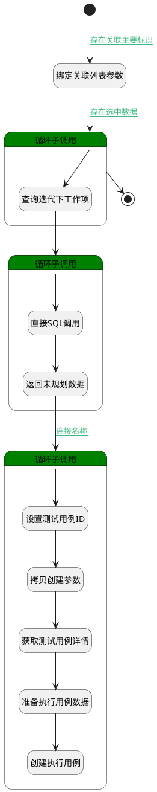

## 通过迭代规划计划 <!-- {docsify-ignore-all} -->

   通过迭代规划计划

### 处理过程




### 处理步骤说明

#### 开始 :id=Begin<sup class="footnote-symbol"> <font color=gray size=1>[开始]</font></sup>


*- N/A*
#### 绑定关联列表参数 :id=BINDPARAM1<sup class="footnote-symbol"> <font color=gray size=1>[绑定参数]</font></sup>


绑定参数`Default(传入变量)` 到 `sprintList(选择迭代)`
#### 循环子调用 :id=LOOPSUBCALL3<sup class="footnote-symbol"> <font color=gray size=1>[循环子调用]</font></sup>


循环参数`sprintList(选择迭代)`，子循环参数使用`sprint(循环迭代对象)`
#### 查询迭代下工作项 :id=RAWSQLCALL2<sup class="footnote-symbol"> <font color=gray size=1>[直接SQL调用]</font></sup>


<p class="panel-title"><b>执行sql语句</b></p>

```sql
select
	*
from
	work_item
where
	SPRINT_ID = ?
	and IS_DELETED = 0
```

<p class="panel-title"><b>执行sql参数</b></p>

1. `sprint(循环迭代对象).ID(标识)`

将执行sql结果赋值给参数`items(选中工作项)`

#### 结束 :id=END1<sup class="footnote-symbol"> <font color=gray size=1>[结束]</font></sup>


返回 `Default(传入变量)`

#### 循环子调用 :id=LOOPSUBCALL2<sup class="footnote-symbol"> <font color=gray size=1>[循环子调用]</font></sup>


循环参数`items(选中工作项)`，子循环参数使用`work_item(工作项)`
#### 直接SQL调用 :id=RAWSQLCALL1<sup class="footnote-symbol"> <font color=gray size=1>[直接SQL调用]</font></sup>


<p class="panel-title"><b>执行sql语句</b></p>

```sql

SELECT
t11.*
FROM `RELATION` t1 
LEFT JOIN `TEST_CASE` t11 ON t1.`TARGET_ID` = t11.`ID` 
LEFT JOIN  `LIBRARY` t12 ON t11.TEST_LIBRARY_ID = t12.ID 
WHERE 
( t11.`IS_DELETED` = 0 ) 
AND
( t1.`PRINCIPAL_TYPE` = 'work_item'  AND  t1.`PRINCIPAL_ID` = ?  AND  t1.`TARGET_TYPE` = 'test_case' ) 
AND
t12.ID = ?
AND
 not exists(select 1 from run t2 
where 
t11.ID= t2.CASE_ID 
AND
t2.PLAN_ID = ?  AND  t11.`IS_DELETED` = 0 )
```

<p class="panel-title"><b>执行sql参数</b></p>

1. `work_item(工作项).id(标识)`
2. `Default(传入变量).library`
3. `Default(传入变量).principal_id`

重置参数`relations(关联用例列表)`，并将执行sql结果赋值给参数`relations(关联用例列表)`

#### 返回未规划数据 :id=DEBUGPARAM1<sup class="footnote-symbol"> <font color=gray size=1>[调试逻辑参数]</font></sup>


> [!NOTE|label:调试信息|icon:fa fa-bug]
> 调试输出参数`relations(关联用例列表)`的详细信息


#### 循环子调用 :id=LOOPSUBCALL1<sup class="footnote-symbol"> <font color=gray size=1>[循环子调用]</font></sup>


循环参数`relations(关联用例列表)`，子循环参数使用`for_temp_obj(循环临时变量)`
#### 设置测试用例ID :id=PREPAREPARAM3<sup class="footnote-symbol"> <font color=gray size=1>[准备参数]</font></sup>


1. 将`for_temp_obj(循环临时变量).ID(标识)` 设置给  `TEST_CASE_INFO(测试用例信息).ID(标识)`

#### 拷贝创建参数 :id=COPYPARAM1<sup class="footnote-symbol"> <font color=gray size=1>[拷贝参数]</font></sup>


拷贝参数`for_temp_obj(循环临时变量)` 到 `select_create_data(需创建的数据)`

#### 获取测试用例详情 :id=DEACTION2<sup class="footnote-symbol"> <font color=gray size=1>[实体行为]</font></sup>


调用实体 [用例(TEST_CASE)](module/TestMgmt/test_case.md) 行为 [Get](module/TestMgmt/test_case#行为) ，行为参数为`TEST_CASE_INFO(测试用例信息)`

将执行结果返回给参数`TEST_CASE_INFO(测试用例信息)`

#### 准备执行用例数据 :id=PREPAREPARAM2<sup class="footnote-symbol"> <font color=gray size=1>[准备参数]</font></sup>


1. 将`for_temp_obj(循环临时变量).ID(标识)` 设置给  `select_create_data(需创建的数据).CASE_ID(测试用例标识)`
2. 将`TEST_CASE_INFO(测试用例信息).STEPS(步骤)` 设置给  `select_create_data(需创建的数据).STEPS(步骤)`
3. 将`用户全局对象.srfpersonid` 设置给  `select_create_data(需创建的数据).CREATE_MAN(建立人)`
4. 将`用户全局对象.srfpersonid` 设置给  `select_create_data(需创建的数据).UPDATE_MAN(更新人)`
5. 将`空值（NULL）` 设置给  `select_create_data(需创建的数据).ID(标识)`
6. 将`Default(传入变量).principal_id` 设置给  `select_create_data(需创建的数据).PLAN_ID(测试计划标识)`

#### 创建执行用例 :id=DEACTION1<sup class="footnote-symbol"> <font color=gray size=1>[实体行为]</font></sup>


调用实体 [执行用例(RUN)](module/TestMgmt/run.md) 行为 [Save](module/TestMgmt/run#行为) ，行为参数为`select_create_data(需创建的数据)`


### 连接条件说明
#### 存在关联主要标识 :id=Begin-BINDPARAM1

`Default(传入变量).principal_id` ISNOTNULL
#### 存在选中数据 :id=BINDPARAM1-LOOPSUBCALL3

`sprintList(选择迭代).size` NOTEQ `0`
#### 连接名称 :id=DEBUGPARAM1-LOOPSUBCALL1

`relations(关联用例列表).size` NOTEQ `0`


### 实体逻辑参数

|    中文名   |    代码名    |  数据类型    |  实体   |备注 |
| --------| --------| -------- | -------- | --------   |
|传入变量(<i class="fa fa-check"/></i>)|Default|数据对象|[执行用例(RUN)](module/TestMgmt/run.md)||
|测试用例信息|TEST_CASE_INFO|数据对象|[用例(TEST_CASE)](module/TestMgmt/test_case.md)||
|循环临时变量|for_temp_obj|数据对象|[执行用例(RUN)](module/TestMgmt/run.md)||
|选中工作项|items|数据对象列表|[工作项(WORK_ITEM)](module/ProjMgmt/work_item.md)||
|关系对象|relationobj|数据对象|[关联(RELATION)](module/Base/relation.md)||
|反向关系对象|relationobj2|数据对象|[关联(RELATION)](module/Base/relation.md)||
|关联用例列表|relations|数据对象列表|[执行用例(RUN)](module/TestMgmt/run.md)||
|需创建的数据|select_create_data|数据对象|[执行用例(RUN)](module/TestMgmt/run.md)||
|循环迭代对象|sprint|数据对象|[迭代(SPRINT)](module/ProjMgmt/sprint.md)||
|选择迭代|sprintList|数据对象列表|[迭代(SPRINT)](module/ProjMgmt/sprint.md)||
|工作项|work_item|数据对象|[工作项(WORK_ITEM)](module/ProjMgmt/work_item.md)||
