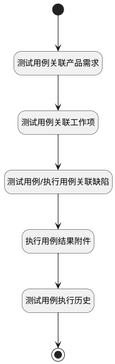

## 执行用例关联分页计数器 <!-- {docsify-ignore-all} -->

   计算分页下关联事项的条数

### 处理过程




### 处理步骤说明

#### 执行用例结果附件 :id=RAWSQLCALL5<sup class="footnote-symbol"> <font color=gray size=1>[直接SQL调用]</font></sup>


<p class="panel-title"><b>执行sql语句</b></p>

```sql
SELECT
	count( t.id ) AS run_re_attachment
FROM
	attachment t 
WHERE
    t.owner_id = ? and t.owner_type = 'RUN'
```

<p class="panel-title"><b>执行sql参数</b></p>

1. `Default(传入变量).ID(标识)`

重置参数`Default(传入变量)`，并将执行sql结果赋值给参数`Default(传入变量)`

#### 开始 :id=Begin<sup class="footnote-symbol"> <font color=gray size=1>[开始]</font></sup>


*- N/A*
#### 结束 :id=END1<sup class="footnote-symbol"> <font color=gray size=1>[结束]</font></sup>


返回 `Default(传入变量)`

#### 测试用例关联产品需求 :id=RAWSQLCALL1<sup class="footnote-symbol"> <font color=gray size=1>[直接SQL调用]</font></sup>


<p class="panel-title"><b>执行sql语句</b></p>

```sql
SELECT
	count( t.id ) AS run_re_idea 
FROM
	idea t 
WHERE
	EXISTS (
	SELECT
		* 
	FROM
		`RELATION` t11 
	WHERE
		t.`ID` = t11.`TARGET_ID` 
		AND (
			t11.`TARGET_TYPE` = 'idea' 
			AND t11.`PRINCIPAL_TYPE` = 'test_case' 
			AND t11.`PRINCIPAL_ID` = ? ) )
			AND (
				t.`IS_DELETED` = 0 
			)
```

<p class="panel-title"><b>执行sql参数</b></p>

1. `Default(传入变量).CASE_ID(测试用例标识)`

重置参数`Default(传入变量)`，并将执行sql结果赋值给参数`Default(传入变量)`

#### 测试用例关联工作项 :id=RAWSQLCALL2<sup class="footnote-symbol"> <font color=gray size=1>[直接SQL调用]</font></sup>


<p class="panel-title"><b>执行sql语句</b></p>

```sql
SELECT
	count( t.id ) AS run_re_work_item 
FROM
	work_item t 
WHERE
t.WORK_ITEM_TYPE_ID not like '%bug%'
AND	EXISTS (
	SELECT
		* 
	FROM
		`RELATION` t11 
	WHERE
		t.`ID` = t11.`TARGET_ID` 
		AND (
			t11.`TARGET_TYPE` = 'work_item' 
			AND t11.`PRINCIPAL_TYPE` = 'test_case' 
			AND t11.`PRINCIPAL_ID` = ? ) )
			AND (
				t.`IS_DELETED` = 0 
			)
```

<p class="panel-title"><b>执行sql参数</b></p>

1. `Default(传入变量).CASE_ID(测试用例标识)`

重置参数`Default(传入变量)`，并将执行sql结果赋值给参数`Default(传入变量)`

#### 测试用例/执行用例关联缺陷 :id=RAWSQLCALL3<sup class="footnote-symbol"> <font color=gray size=1>[直接SQL调用]</font></sup>


<p class="panel-title"><b>执行sql语句</b></p>

```sql
SELECT
	count( t.id ) AS run_re_bug 
FROM
	work_item t 
WHERE
	EXISTS (
	SELECT
		* 
	FROM
		`RELATION` t11 
	WHERE
		t.`ID` = t11.`TARGET_ID` 
		AND (
			t11.`TARGET_TYPE` = 'bug' 
			AND (t11.`PRINCIPAL_TYPE` = 'run' or t11.`PRINCIPAL_TYPE` = 'test_case')
			AND t11.`PRINCIPAL_ID` = ? ) )
			AND (
				t.`IS_DELETED` = 0 
			)
```

<p class="panel-title"><b>执行sql参数</b></p>

1. `Default(传入变量).ID(标识)`

重置参数`Default(传入变量)`，并将执行sql结果赋值给参数`Default(传入变量)`

#### 测试用例执行历史 :id=RAWSQLCALL4<sup class="footnote-symbol"> <font color=gray size=1>[直接SQL调用]</font></sup>


<p class="panel-title"><b>执行sql语句</b></p>

```sql
SELECT
	count( t.id ) AS run_re_run_history
FROM
	run_history t 
WHERE
    t.run_id = ?
```

<p class="panel-title"><b>执行sql参数</b></p>

1. `Default(传入变量).ID(标识)`

重置参数`Default(传入变量)`，并将执行sql结果赋值给参数`Default(传入变量)`


### 实体逻辑参数

|    中文名   |    代码名    |  数据类型    |  实体   |备注 |
| --------| --------| -------- | -------- | --------   |
|传入变量(<i class="fa fa-check"/></i>)|Default|数据对象|[执行用例(RUN)](module/TestMgmt/run.md)||
