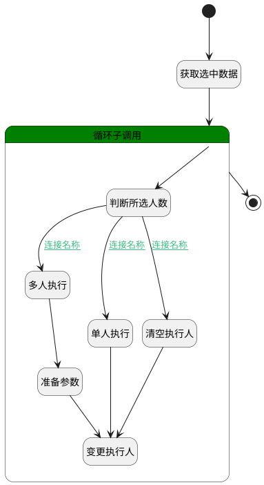

## 设置执行人 <!-- {docsify-ignore-all} -->

   设置当前执行用例执行人

### 处理过程




### 处理步骤说明

#### 开始 :id=Begin<sup class="footnote-symbol"> <font color=gray size=1>[开始]</font></sup>


*- N/A*
#### 获取选中数据 :id=BINDPARAM1<sup class="footnote-symbol"> <font color=gray size=1>[绑定参数]</font></sup>


绑定参数`Default(传入变量)` 到 `srfactionparam(选择数据对象)`
#### 多人执行 :id=RAWSFCODE1<sup class="footnote-symbol"> <font color=gray size=1>[直接后台代码]</font></sup>


<p class="panel-title"><b>执行代码[Groovy]</b></p>

```groovy
def _default = logic.param('Default').getReal()
def for_temp_obj = logic.param('for_temp_obj').getReal()

def list = []
list = for_temp_obj.get('executors')

if (list.size != 0) {
    list[0].set('is_assignee', 1)
    _default.set('executor_name', list[0].get('user_name'))
    _default.set('executor_id', list[0].get('user_id'))
}
```

#### 准备参数 :id=PREPAREPARAM3<sup class="footnote-symbol"> <font color=gray size=1>[准备参数]</font></sup>


1. 将`for_temp_obj(循环临时变量).MULTIPLE_PEOPLE(多人任务)` 设置给  `Default(传入变量).MULTIPLE_PEOPLE(多人任务)`
2. 将`for_temp_obj(循环临时变量).EXECUTORS(执行人)` 设置给  `Default(传入变量).EXECUTORS(执行人)`

#### 循环子调用 :id=LOOPSUBCALL1<sup class="footnote-symbol"> <font color=gray size=1>[循环子调用]</font></sup>


循环参数`srfactionparam(选择数据对象)`，子循环参数使用`for_temp_obj(循环临时变量)`
#### 判断所选人数 :id=RAWSFCODE2<sup class="footnote-symbol"> <font color=gray size=1>[直接后台代码]</font></sup>


<p class="panel-title"><b>执行代码[Groovy]</b></p>

```groovy
def _default = logic.param('Default').getReal()
def for_temp_obj = logic.param('for_temp_obj').getReal()

def list = []
list = for_temp_obj.get('executors')


if (list ==null){
    for_temp_obj.set('multiple_people', -1)
}
else{
    if (list.size > 1) {
        for_temp_obj.set('multiple_people', 1)
    } else {
        for_temp_obj.set('multiple_people', 0)
    } 
}

```

#### 单人执行 :id=RAWSFCODE3<sup class="footnote-symbol"> <font color=gray size=1>[直接后台代码]</font></sup>


<p class="panel-title"><b>执行代码[Groovy]</b></p>

```groovy
def _default = logic.param('Default').getReal()
def for_temp_obj = logic.param('for_temp_obj').getReal()

def list = []
list = for_temp_obj.get('executors')

if (list.size == 1) {
    _default.set('executor_name', list[0].get('user_name'))
    _default.set('executor_id', list[0].get('user_id'))
    _default.set('multiple_people', 0)
    _default.set('executors', null)
}
```

#### 变更执行人 :id=DEACTION1<sup class="footnote-symbol"> <font color=gray size=1>[实体行为]</font></sup>


调用实体 [执行用例(RUN)](module/TestMgmt/run.md) 行为 [Update](module/TestMgmt/run#行为) ，行为参数为`Default(传入变量)`

#### 结束 :id=END1<sup class="footnote-symbol"> <font color=gray size=1>[结束]</font></sup>


*- N/A*

#### 清空执行人 :id=PREPAREPARAM2<sup class="footnote-symbol"> <font color=gray size=1>[准备参数]</font></sup>


1. 将`空值（NULL）` 设置给  `Default(传入变量).EXECUTOR_ID(执行人标识)`
2. 将`空值（NULL）` 设置给  `Default(传入变量).MULTIPLE_PEOPLE(多人任务)`
3. 将`空值（NULL）` 设置给  `Default(传入变量).EXECUTOR_NAME(执行人)`
4. 将`空值（NULL）` 设置给  `Default(传入变量).EXECUTORS(执行人)`


### 连接条件说明
#### 连接名称 :id=RAWSFCODE2-RAWSFCODE1

`for_temp_obj(循环临时变量).MULTIPLE_PEOPLE(多人任务)` EQ `1`
#### 连接名称 :id=RAWSFCODE2-RAWSFCODE3

`for_temp_obj(循环临时变量).MULTIPLE_PEOPLE(多人任务)` EQ `0`
#### 连接名称 :id=RAWSFCODE2-PREPAREPARAM2

`for_temp_obj(循环临时变量).MULTIPLE_PEOPLE(多人任务)` EQ `-1`


### 实体逻辑参数

|    中文名   |    代码名    |  数据类型    |  实体   |备注 |
| --------| --------| -------- | -------- | --------   |
|传入变量(<i class="fa fa-check"/></i>)|Default|数据对象|[执行用例(RUN)](module/TestMgmt/run.md)||
|循环临时变量|for_temp_obj|数据对象|[执行用例(RUN)](module/TestMgmt/run.md)||
|选择数据对象|srfactionparam|数据对象列表|[执行用例(RUN)](module/TestMgmt/run.md)||
