## 设置第一执行人（表格使用） <!-- {docsify-ignore-all} -->

   

### 处理过程

```plantuml
@startuml
hide empty description
<style>
root {
  HyperlinkColor #42b983
}
</style>

hide empty description
state "开始" as Begin <<start>> [[$./set_first_executor#begin {"开始"}]]
state "执行脚本代码" as RAWSFCODE1  [[$./set_first_executor#rawsfcode1 {"执行脚本代码"}]]
state "结束" as END1 <<end>> [[$./set_first_executor#end1 {"结束"}]]


Begin --> RAWSFCODE1
RAWSFCODE1 --> END1


@enduml
```




### 处理步骤说明

#### 开始 :id=Begin<sup class="footnote-symbol"> <font color=gray size=1>[开始]</font></sup>


*- N/A*
#### 执行脚本代码 :id=RAWSFCODE1<sup class="footnote-symbol"> <font color=gray size=1>[直接后台代码]</font></sup>


<p class="panel-title"><b>执行代码[Groovy]</b></p>

```groovy
def _default = logic.param('Default').getReal()

def list = []
if (_default.get('executors') != null) {
    _default.set('executor_name', null)
    _default.set('executor_id', null)
    list = _default.get('executors')
    if (list.size != 0) {
        if (list[0].get('is_assignee') == null) {
            list[0].set('is_assignee', 1)
            _default.set('executor_name', list[0].get('user_name'))
            _default.set('executor_id', list[0].get('user_id'))
        }
    }
}
```

#### 结束 :id=END1<sup class="footnote-symbol"> <font color=gray size=1>[结束]</font></sup>


返回 `Default(传入变量)`


### 实体逻辑参数

|    中文名   |    代码名    |  数据类型    |  实体   |备注 |
| --------| --------| -------- | -------- | --------   |
|传入变量(<i class="fa fa-check"/></i>)|Default|数据对象|[执行用例(RUN)](module/TestMgmt/run.md)||
