## 计算门户参数（测试） <!-- {docsify-ignore-all} -->

   门户界面行为前置逻辑，先计算门户数据

### 处理过程

```plantuml
@startuml
hide footbox
<style>
root {
  HyperlinkColor #42b983
}
</style>

hide empty description
state "开始" as Begin <<start>> [[$./calc_portlet_data#begin {开始}]]
state "结束" as END1 <<end>> [[$./calc_portlet_data#end1 {结束}]]
state "打开视图" as DEUIACTION1  [[$./calc_portlet_data#deuiaction1 {打开视图}]]
state "计算门户配置参数" as PREPAREJSPARAM1  [[$./calc_portlet_data#preparejsparam1 {计算门户配置参数}]]


Begin --> PREPAREJSPARAM1
PREPAREJSPARAM1 --> DEUIACTION1
DEUIACTION1 --> END1


@enduml
```

### 处理步骤说明

#### 开始 :id=Begin [开始]

#### 结束 :id=END1 [结束]

#### 计算门户配置参数 :id=PREPAREJSPARAM1 [准备参数]

1. 将`ctrl(部件).state.config` 设置给  `data(选项操作视图参数)`

#### 打开视图 :id=DEUIACTION1 [实体界面行为调用]

调用实体 [执行用例(RUN)](module/TestMgmt/run.md) 界面行为 [打开选项操作视图（门户）（测试）](module/TestMgmt/run#界面行为) ，行为参数为`data(选项操作视图参数)`

### 实体逻辑参数

|    中文名   |    代码名    |  数据类型      |备注 |
| --------| --------| --------  | --------   |
|传入变量(<i class="fa fa-check"/></i>)|Default|数据对象||
|部件|ctrl|当前部件对象||
|选项操作视图参数|data|数据对象||
