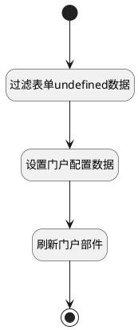

## 填充并刷新门户数据（测试） <!-- {docsify-ignore-all} -->

   门户界面行为打开选项操作视图后，计算需要填充到视图上的数据

### 处理过程




### 处理步骤说明

#### 开始 :id=Begin<sup class="footnote-symbol"> <font color=gray size=1>[开始]</font></sup>


#### 结束 :id=END1<sup class="footnote-symbol"> <font color=gray size=1>[结束]</font></sup>


#### 过滤表单undefined数据 :id=RAWJSCODE1<sup class="footnote-symbol"> <font color=gray size=1>[直接前台代码]</font></sup>


<p class="panel-title"><b>执行代码</b></p>

```javascript
const dataUIMap = uiLogic.default.$dataUIMap;
uiLogic.config = {};
dataUIMap.forEach((value, key) => {
    if (!value.isOriginField) {
        uiLogic.config[key] = uiLogic.default[key];
    }
})

uiLogic.config = Object.fromEntries(
  Object.entries(uiLogic.config).filter(([key, value]) => !!value)
);
```

#### 设置门户配置数据 :id=VIEWCTRLINVOKE1<sup class="footnote-symbol"> <font color=gray size=1>[视图部件调用]</font></sup>


调用`ctrl(部件)`的方法`setConfig`，参数为`config(门户配置)`
#### 刷新门户部件 :id=VIEWCTRLINVOKE2<sup class="footnote-symbol"> <font color=gray size=1>[视图部件调用]</font></sup>


调用`ctrl(部件)`的方法`refresh`，参数为`Default(传入变量)`


### 实体逻辑参数

|    中文名   |    代码名    |  数据类型      |备注 |
| --------| --------| --------  | --------   |
|部件|ctrl|当前部件对象||
|门户配置|config|数据对象||
|传入变量(<i class="fa fa-check"/></i>)|Default|数据对象||
