## 获取实际工时 <!-- {docsify-ignore-all} -->

   获取工时信息，并计算实际工时

### 处理过程

```plantuml
@startuml
hide footbox
<style>
root {
  HyperlinkColor #42b983
}
</style>

hide empty description
state "开始" as Begin <<start>> [[$./get_actual_workload#begin {开始}]]
state "计算工时进度" as RAWJSCODE1  [[$./get_actual_workload#rawjscode1 {计算工时进度}]]
state "结束" as END1 <<end>> [[$./get_actual_workload#end1 {结束}]]
state "获取实际工时" as DEACTION1  [[$./get_actual_workload#deaction1 {获取实际工时}]]


Begin --> DEACTION1
DEACTION1 --> RAWJSCODE1
RAWJSCODE1 --> END1


@enduml
```




### 处理步骤说明

#### 开始 :id=Begin<sup class="footnote-symbol"> <font color=gray size=1>[开始]</font></sup>


#### 获取实际工时 :id=DEACTION1<sup class="footnote-symbol"> <font color=gray size=1>[实体行为]</font></sup>


调用实体 [执行用例(RUN)](module/TestMgmt/run.md) 行为 [获取实际工时(get_actual_workload)](module/TestMgmt/run#行为) ，行为参数为`temp(临时数据对象)`

将执行结果返回给参数`temp(临时数据对象)`

#### 计算工时进度 :id=RAWJSCODE1<sup class="footnote-symbol"> <font color=gray size=1>[直接前台代码]</font></sup>


<p class="panel-title"><b>执行代码</b></p>

```javascript
var form_data = view.layoutPanel.panelItems.form.control.data;
form_data.estimated_workload = uiLogic.temp.estimated_workload;
form_data.remaining_workload = uiLogic.temp.remaining_workload;
var remaining_workload = form_data.remaining_workload;
var actual_workload = uiLogic.temp.actual_workload;
form_data.actual_workload = actual_workload;
var estimated_workload = form_data.estimated_workload;  
var estimated = 0; // 预估工时
if(estimated_workload){
	estimated = Number(estimated_workload);
}
var actual = 0; // 之前登记的实际工时
if(actual_workload){
	actual = Number(actual_workload);
}
var remaining = 0;
if(remaining_workload){
	remaining = Number(remaining_workload);
}
// 计算工时进度
if((actual + remaining) != 0){
	var schedule = ((actual / (actual + remaining)) * 100).toFixed(1);
	form_data.workload_schedule = schedule;
}
```

#### 结束 :id=END1<sup class="footnote-symbol"> <font color=gray size=1>[结束]</font></sup>


### 实体逻辑参数

|    中文名   |    代码名    |  数据类型      |备注 |
| --------| --------| --------  | --------   |
|传入变量(<i class="fa fa-check"/></i>)|Default|数据对象||
|临时数据对象|temp|数据对象||
