## 打开关联用例 <!-- {docsify-ignore-all} -->

   调用界面行为，打开关联用例

### 处理过程

```plantuml
@startuml
hide footbox
<style>
root {
  HyperlinkColor #42b983
}
</style>

hide empty description
state "开始" as Begin <<start>> [[$./open_re_run#begin {开始}]]
state "打开关联用例" as DEUIACTION1  [[$./open_re_run#deuiaction1 {打开关联用例}]]
state "结束" as END1 <<end>> [[$./open_re_run#end1 {结束}]]


Begin --> DEUIACTION1
DEUIACTION1 --> END1


@enduml
```

### 处理步骤说明

#### 开始 :id=Begin [开始]

#### 结束 :id=END1 [结束]

#### 打开关联用例 :id=DEUIACTION1 [实体界面行为调用]

调用实体 [执行用例(RUN)](module/TestMgmt/run.md) 界面行为 [打开关联用例](module/TestMgmt/run#界面行为) 

### 实体逻辑参数

|    中文名   |    代码名    |  数据类型      |备注 |
| --------| --------| --------  | --------   |
|传入变量(<i class="fa fa-check"/></i>)|Default|数据对象||
