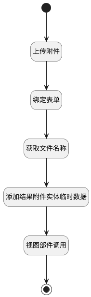

## 添加附件数据 <!-- {docsify-ignore-all} -->

   调用附件上传行为，添加附件数据

### 处理过程




### 处理步骤说明

#### 开始 :id=Begin<sup class="footnote-symbol"> <font color=gray size=1>[开始]</font></sup>


#### 上传附件 :id=DEUIACTION1<sup class="footnote-symbol"> <font color=gray size=1>[实体界面行为调用]</font></sup>


调用实体 [执行用例结果附件(RUN_ATTACHMENT)](module/TestMgmt/run_attachment.md) 界面行为 [上传附件](module/TestMgmt/run_attachment#界面行为) ，行为参数为`files(上传文件)`

#### 绑定表单 :id=PREPAREJSPARAM1<sup class="footnote-symbol"> <font color=gray size=1>[准备参数]</font></sup>


1. 将`view(当前视图).parentView.layoutPanel.panelItems.form.control` 设置给  `form(主表单)`

#### 获取文件名称 :id=RAWJSCODE1<sup class="footnote-symbol"> <font color=gray size=1>[直接前台代码]</font></sup>


<p class="panel-title"><b>执行代码</b></p>

```javascript
uiLogic.run_attachment.name = uiLogic.files[0].name;
uiLogic.run_attachment.file_id = uiLogic.files[0].id;
uiLogic.run_attachment.owner_id = uiLogic.context.run;
uiLogic.run_attachment.owner_type = 'RUN';
```

#### 添加结果附件实体临时数据 :id=RAWJSCODE2<sup class="footnote-symbol"> <font color=gray size=1>[直接前台代码]</font></sup>


<p class="panel-title"><b>执行代码</b></p>

```javascript
view.layoutPanel.panelItems.grid.state.visible = true;
ibiz.hub.getApp(context.srfappid).deService.exec(
    'plmweb.run_attachment',
    'create',
    context,
    uiLogic.run_attachment,
);

```

#### 视图部件调用 :id=VIEWCTRLINVOKE1<sup class="footnote-symbol"> <font color=gray size=1>[视图部件调用]</font></sup>


调用`form(主表单)`的方法`save`，参数为`form(主表单)`
#### 结束 :id=END1<sup class="footnote-symbol"> <font color=gray size=1>[结束]</font></sup>


### 实体逻辑参数

|    中文名   |    代码名    |  数据类型      |备注 |
| --------| --------| --------  | --------   |
|主表单|form|部件对象||
|结果附件对象|run_attachment|数据对象||
|上下文|context|导航视图参数绑定参数||
|当前视图|view|当前视图对象||
|上传文件|files|数据对象列表||
