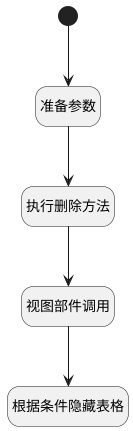

## 删除 <!-- {docsify-ignore-all} -->

   执行删除方法，并根据条件隐藏表格（数据为空）

### 处理过程




### 处理步骤说明

#### 开始 :id=Begin<sup class="footnote-symbol"> <font color=gray size=1>[开始]</font></sup>


#### 准备参数 :id=PREPAREJSPARAM1<sup class="footnote-symbol"> <font color=gray size=1>[准备参数]</font></sup>


1. 将`Default(传入变量).id` 设置给  `context(上下文).run_attachment`
2. 将`view(当前视图对象).parentView.layoutPanel.panelItems.form.control` 设置给  `form(主表单对象)`

#### 执行删除方法 :id=RAWJSCODE2<sup class="footnote-symbol"> <font color=gray size=1>[直接前台代码]</font></sup>


<p class="panel-title"><b>执行代码</b></p>

```javascript
ibiz.hub.getApp(context.srfappid).deService.exec(
    'plmweb.run_attachment',
    'remove',
    context,
    uiLogic.default,
);


```

#### 视图部件调用 :id=VIEWCTRLINVOKE1<sup class="footnote-symbol"> <font color=gray size=1>[视图部件调用]</font></sup>


调用`form(主表单对象)`的方法`save`，参数为`form(主表单对象)`
#### 根据条件隐藏表格 :id=RAWJSCODE3<sup class="footnote-symbol"> <font color=gray size=1>[直接前台代码]</font></sup>


<p class="panel-title"><b>执行代码</b></p>

```javascript
if(uiLogic.view.layoutPanel.panelItems.total.data.total == 0){
    view.layoutPanel.panelItems.grid.state.visible = false;
}
```


### 实体逻辑参数

|    中文名   |    代码名    |  数据类型      |备注 |
| --------| --------| --------  | --------   |
|传入变量(<i class="fa fa-check"/></i>)|Default|数据对象||
|主表单对象|form|部件对象||
|上下文|context|导航视图参数绑定参数||
|当前视图对象|view|当前视图对象||
