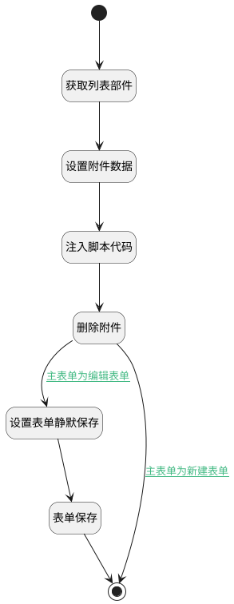

## 附件删除（移动端） <!-- {docsify-ignore-all} -->

   自动判断为列表或表单附件，按类别删除

### 处理过程




### 处理步骤说明

#### 开始 :id=Begin<sup class="footnote-symbol"> <font color=gray size=1>[开始]</font></sup>


#### 结束 :id=END1<sup class="footnote-symbol"> <font color=gray size=1>[结束]</font></sup>


#### 获取列表部件 :id=PREPAREJSPARAM1<sup class="footnote-symbol"> <font color=gray size=1>[准备参数]</font></sup>


1. 将`view(当前视图对象).ctx.controllersMap.get("mdctrl")` 设置给  `mdctrl(列表)`
2. 将`view(当前视图对象).ctx.parent.controllersMap.get("form")` 设置给  `form(主表单对象)`
3. 将`Default(传入变量).id` 设置给  `params(视图参数).id`

#### 设置附件数据 :id=RAWJSCODE1<sup class="footnote-symbol"> <font color=gray size=1>[直接前台代码]</font></sup>


<p class="panel-title"><b>执行代码</b></p>

```javascript
uiLogic.attach = { data: uiLogic.default, silent: true };
```

#### 注入脚本代码 :id=RAWJSCODE2<sup class="footnote-symbol"> <font color=gray size=1>[直接前台代码]</font></sup>


<p class="panel-title"><b>执行代码</b></p>

```javascript
console.log("附件数据",uiLogic.attach)
```

#### 删除附件 :id=DEACTION1<sup class="footnote-symbol"> <font color=gray size=1>[实体行为]</font></sup>


调用实体 [执行用例结果附件(RUN_ATTACHMENT)](module/TestMgmt/run_attachment.md) 行为 [Remove](module/TestMgmt/run_attachment#行为) ，行为参数为`attach(附件数据)`

#### 设置表单静默保存 :id=PREPAREJSPARAM2<sup class="footnote-symbol"> <font color=gray size=1>[准备参数]</font></sup>


1. 将`true` 设置给  `Default(传入变量).silent`

#### 表单保存 :id=VIEWCTRLINVOKE2<sup class="footnote-symbol"> <font color=gray size=1>[视图部件调用]</font></sup>


调用`form(主表单对象)`的方法`save`，参数为`Default(传入变量)`
### 连接条件说明
#### 主表单为编辑表单 :id=DEACTION1-PREPAREJSPARAM2

```form(主表单对象).state.data.id``` ISNOTNULL
#### 主表单为新建表单 :id=DEACTION1-END1

```form(主表单对象).state.data.id``` ISNULL


### 实体逻辑参数

|    中文名   |    代码名    |  数据类型      |备注 |
| --------| --------| --------  | --------   |
|主表单对象|form|部件对象||
|当前视图对象|view|当前视图对象||
|传入变量(<i class="fa fa-check"/></i>)|Default|数据对象||
|列表|mdctrl|部件对象||
|附件数据|attach|数据对象||
|视图参数|params|||
