## 执行结果获取 <!-- {docsify-ignore-all} -->

   获取执行结果

### 处理过程

```plantuml
@startuml
hide empty description
<style>
root {
  HyperlinkColor #42b983
}
</style>

hide empty description
state "开始" as Begin <<start>> [[$./run_history_get#begin {"开始"}]]
state "直接SQL调用" as RAWSQLCALL1  [[$./run_history_get#rawsqlcall1 {"直接SQL调用"}]]
state "结束" as END1 <<end>> [[$./run_history_get#end1 {"结束"}]]


Begin --> RAWSQLCALL1
RAWSQLCALL1 --> END1


@enduml
```




### 处理步骤说明

#### 开始 :id=Begin<sup class="footnote-symbol"> <font color=gray size=1>[开始]</font></sup>


*- N/A*
#### 直接SQL调用 :id=RAWSQLCALL1<sup class="footnote-symbol"> <font color=gray size=1>[直接SQL调用]</font></sup>


<p class="panel-title"><b>执行sql语句</b></p>

```sql
SELECT * FROM run_history t1 WHERE t1.RUN_ID = ?
```

<p class="panel-title"><b>执行sql参数</b></p>

1. `Default(传入变量).RUN_ID(执行用例标识)`

重置参数`run_history_list(执行结果列表)`，并将执行sql结果赋值给参数`run_history_list(执行结果列表)`

#### 结束 :id=END1<sup class="footnote-symbol"> <font color=gray size=1>[结束]</font></sup>


*- N/A*


### 实体逻辑参数

|    中文名   |    代码名    |  数据类型    |  实体   |备注 |
| --------| --------| -------- | -------- | --------   |
|传入变量(<i class="fa fa-check"/></i>)|Default|数据对象|[执行结果(RUN_HISTORY)](module/TestMgmt/run_history.md)||
|执行结果列表|run_history_list|数据对象列表|[执行结果(RUN_HISTORY)](module/TestMgmt/run_history.md)||
|执行用例信息|run_info|数据对象|[执行用例(RUN)](module/TestMgmt/run.md)||
