## 获取最新执行结果 <!-- {docsify-ignore-all} -->

   

### 处理过程

```plantuml
@startuml
hide empty description
<style>
root {
  HyperlinkColor #42b983
}
</style>

hide empty description
state "开始" as Begin <<start>> [[$./case_latest_result#begin {"开始"}]]
state "准备参数" as PREPAREPARAM1  [[$./case_latest_result#prepareparam1 {"准备参数"}]]
state "调试逻辑参数" as DEBUGPARAM1  [[$./case_latest_result#debugparam1 {"调试逻辑参数"}]]
state "实体数据集" as DEDATASET1  [[$./case_latest_result#dedataset1 {"实体数据集"}]]


Begin --> PREPAREPARAM1
PREPAREPARAM1 --> DEDATASET1


@enduml
```

### 处理步骤说明

#### 开始 :id=Begin [开始]

*- N/A*
#### 准备参数 :id=PREPAREPARAM1 [准备参数]

1. 将`1` 设置给  `run_filter(执行用例过滤器).size`
2. 将`1` 设置给  `run_filter(执行用例过滤器).N_STATUS_ISNOTNULL`
3. 将`executed_at,desc` 设置给  `run_filter(执行用例过滤器).sort`

#### 调试逻辑参数 :id=DEBUGPARAM1 [调试逻辑参数]

> [!NOTE|label:调试信息|icon:fa fa-bug]
> 调试输出参数`Default(传入变量)`的详细信息

#### 实体数据集 :id=DEDATASET1 [实体数据集]

调用实体 [执行用例(RUN)](module/TestMgmt/run.md) 数据集合 [测试用例获取最新执行结果(case_latest_executed)](module/TestMgmt/run#数据集合) ，查询参数为`run_filter(执行用例过滤器)`

将执行结果返回给参数`run_page(执行用例分页结果变量)`

### 实体逻辑参数

|    中文名   |    代码名    |  数据类型    |  实体   |备注 |
| --------| --------| -------- | -------- | --------   |
|传入变量(<i class="fa fa-check"/></i>)|Default|过滤器|||
|执行用例过滤器|run_filter|过滤器|||
|执行用例分页结果变量|run_page|分页查询|||
