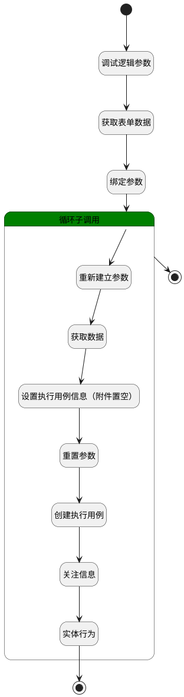

## 移入计划 <!-- {docsify-ignore-all} -->

   将选中测试用例移入执行计划（在指定的执行用例内生成执行用例）

### 处理过程




### 处理步骤说明

#### 开始 :id=Begin<sup class="footnote-symbol"> <font color=gray size=1>[开始]</font></sup>


*- N/A*
#### 调试逻辑参数 :id=DEBUGPARAM1<sup class="footnote-symbol"> <font color=gray size=1>[调试逻辑参数]</font></sup>


> [!NOTE|label:调试信息|icon:fa fa-bug]
> 调试输出参数`Default(传入变量)`的详细信息


#### 获取表单数据 :id=BINDPARAM1<sup class="footnote-symbol"> <font color=gray size=1>[绑定参数]</font></sup>


绑定参数`Default(传入变量)` 到 `srfactionparam(选择的数据对象)`
#### 绑定参数 :id=BINDPARAM2<sup class="footnote-symbol"> <font color=gray size=1>[绑定参数]</font></sup>


绑定参数`Default(传入变量)` 到 `id(要更改状态的主键)`
#### 循环子调用 :id=LOOPSUBCALL1<sup class="footnote-symbol"> <font color=gray size=1>[循环子调用]</font></sup>


循环参数`srfactionparam(选择的数据对象)`，子循环参数使用`for_temp_obj(循环临时变量)`
#### 重新建立参数 :id=RENEWPARAM1<sup class="footnote-symbol"> <font color=gray size=1>[重新建立参数]</font></sup>


重建参数```temp_obj(临时变量)```
#### 获取数据 :id=DEACTION2<sup class="footnote-symbol"> <font color=gray size=1>[实体行为]</font></sup>


调用实体 [用例(TEST_CASE)](module/TestMgmt/test_case.md) 行为 [Get](module/TestMgmt/test_case#行为) ，行为参数为`id(要更改状态的主键)`

将执行结果返回给参数`temp_obj(临时变量)`

#### 设置执行用例信息（附件置空） :id=PREPAREPARAM1<sup class="footnote-symbol"> <font color=gray size=1>[准备参数]</font></sup>


1. 将`temp_obj(临时变量)` 拷贝到  `RUNINFO(RUN信息)`
2. 将`空值（NULL）` 设置给  `RUNINFO(RUN信息).ATTENTIONS(关注)`
3. 将`空值（NULL）` 设置给  `RUNINFO(RUN信息).EXECUTED_AT(执行时间)`
4. 将`temp_obj(临时变量).ATTACHMENTS(附件)` 绑定给  `attachments(附件数据列表)`
5. 将`空值（NULL）` 设置给  `RUNINFO(RUN信息).ATTACHMENTS`
6. 将`空值（NULL）` 设置给  `RUNINFO(RUN信息).ID(标识)`
7. 将`temp_obj(临时变量).ID(标识)` 设置给  `RUNINFO(RUN信息).CASE_ID(测试用例标识)`
8. 将`for_temp_obj(循环临时变量).test_plan` 设置给  `RUNINFO(RUN信息).PLAN_ID(测试计划标识)`

#### 重置参数 :id=RESETPARAM1<sup class="footnote-symbol"> <font color=gray size=1>[重置参数]</font></sup>


重置参数```attention_info(关注信息)```
#### 创建执行用例 :id=DEACTION1<sup class="footnote-symbol"> <font color=gray size=1>[实体行为]</font></sup>


调用实体 [执行用例(RUN)](module/TestMgmt/run.md) 行为 [Save](module/TestMgmt/run#行为) ，行为参数为`RUNINFO(RUN信息)`

#### 结束 :id=END2<sup class="footnote-symbol"> <font color=gray size=1>[结束]</font></sup>


*- N/A*

#### 关注信息 :id=PREPAREPARAM2<sup class="footnote-symbol"> <font color=gray size=1>[准备参数]</font></sup>


1. 将`temp_obj(临时变量).CREATE_MAN(建立人)` 设置给  `attention_info(关注信息).USER_ID(关注人)`
2. 将`用户全局对象.srfpersonname` 设置给  `attention_info(关注信息).NAME(名称)`
3. 将`RUNINFO(RUN信息).ID(标识)` 设置给  `attention_info(关注信息).OWNER_ID(所属数据标识)`
4. 将`RUN` 设置给  `attention_info(关注信息).OWNER_TYPE(所属数据对象)`
5. 将`RUN` 设置给  `attention_info(关注信息).OWNER_SUBTYPE(所属对象子类型)`
6. 将`40` 设置给  `attention_info(关注信息).TYPE(关注类型)`

#### 实体行为 :id=DEACTION3<sup class="footnote-symbol"> <font color=gray size=1>[实体行为]</font></sup>


调用实体 [关注(ATTENTION)](module/Base/attention.md) 行为 [Save](module/Base/attention#行为) ，行为参数为`attention_info(关注信息)`

#### 结束 :id=END1<sup class="footnote-symbol"> <font color=gray size=1>[结束]</font></sup>


*- N/A*


### 实体逻辑参数

|    中文名   |    代码名    |  数据类型    |  实体   |备注 |
| --------| --------| -------- | -------- | --------   |
|传入变量(<i class="fa fa-check"/></i>)|Default|数据对象|[用例(TEST_CASE)](module/TestMgmt/test_case.md)||
|RUN信息|RUNINFO|数据对象|[执行用例(RUN)](module/TestMgmt/run.md)||
|附件数据|attachment|数据对象|[附件(ATTACHMENT)](module/Base/attachment.md)||
|附件数据列表|attachments|数据对象列表|[附件(ATTACHMENT)](module/Base/attachment.md)||
|关注信息|attention_info|数据对象|[关注(ATTENTION)](module/Base/attention.md)||
|循环临时变量|for_temp_obj|数据对象|[用例(TEST_CASE)](module/TestMgmt/test_case.md)||
|要更改状态的主键|id|简单数据|||
|选中工作项的主键|ids|简单数据列表|||
|选择的数据对象|srfactionparam|数据对象列表|[用例(TEST_CASE)](module/TestMgmt/test_case.md)||
|临时附件对象|temp_att_obj|数据对象|[附件(ATTACHMENT)](module/Base/attachment.md)||
|临时变量|temp_obj|数据对象|[用例(TEST_CASE)](module/TestMgmt/test_case.md)||
