## 选择用例模板 <!-- {docsify-ignore-all} -->

   获取选中模板并返回详情

### 处理过程

```plantuml
@startuml
hide empty description
<style>
root {
  HyperlinkColor #42b983
}
</style>

hide empty description
state "开始" as Begin <<start>> [[$./choose_case_template#begin {"开始"}]]
state "结束" as END1 <<end>> [[$./choose_case_template#end1 {"结束"}]]
state "获取选中数据ID" as PREPAREPARAM1  [[$./choose_case_template#prepareparam1 {"获取选中数据ID"}]]
state "获取选中模板详情" as DEACTION1  [[$./choose_case_template#deaction1 {"获取选中模板详情"}]]


Begin --> PREPAREPARAM1
PREPAREPARAM1 --> DEACTION1
DEACTION1 --> END1


@enduml
```

### 处理步骤说明

#### 开始 :id=Begin [开始]

*- N/A*
#### 结束 :id=END1 [结束]

返回 `choosed_data(选择的模板)`

#### 获取选中数据ID :id=PREPAREPARAM1 [准备参数]

1. 将`Default(传入变量).choosed_data` 设置给  `choosed_data(选择的模板).ID(标识)`

#### 获取选中模板详情 :id=DEACTION1 [实体行为]

调用实体 [用例模板(TEST_CASE_TEMPLATE)](module/TestMgmt/test_case_template.md) 行为 [Get](module/TestMgmt/test_case_template#行为) ，行为参数为`choosed_data(选择的模板)`

将执行结果返回给参数`choosed_data(选择的模板)`

### 实体逻辑参数

|    中文名   |    代码名    |  数据类型    |  实体   |备注 |
| --------| --------| -------- | -------- | --------   |
|传入变量(<i class="fa fa-check"/></i>)|Default|数据对象|[用例(TEST_CASE)](module/TestMgmt/test_case.md)||
|选择的模板|choosed_data|数据对象|[用例模板(TEST_CASE_TEMPLATE)](module/TestMgmt/test_case_template.md)||
|临时变量|for_obj|数据对象|||
|选中的数据|srfactionparam|数据对象列表|[用例模板(TEST_CASE_TEMPLATE)](module/TestMgmt/test_case_template.md)||
