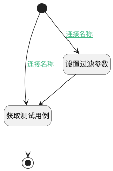

## 测试用例 <!-- {docsify-ignore-all} -->

   

### 处理过程

### 处理步骤说明

#### 开始 :id=Begin [开始]

*- N/A*
#### 设置过滤参数 :id=PREPAREPARAM2 [准备参数]

1. 将`Default(传入变量).srfkeys` 设置给  `Default(传入变量).n_id_in`

#### 获取测试用例 :id=DEDATASET1 [实体数据集]

调用实体 [用例(TEST_CASE)](module/TestMgmt/test_case.md) 数据集合 [正常状态(normal)](module/TestMgmt/test_case#数据集合) ，查询参数为`Default(传入变量)`

将执行结果返回给参数`page(用例分页数据)`

#### 结束 :id=END1 [结束]

返回 `page(用例分页数据)`

### 连接条件说明
#### 连接名称 :id=Begin-PREPAREPARAM2

`Default(传入变量).srfkeys` ISNOTNULL
#### 连接名称 :id=Begin-DEDATASET1

`Default(传入变量).srfkeys` ISNULL

### 实体逻辑参数

|    中文名   |    代码名    |  数据类型    |  实体   |备注 |
| --------| --------| -------- | -------- | --------   |
|传入变量(<i class="fa fa-check"/></i>)|Default|过滤器|||
|用例分页数据|page|分页查询|||
