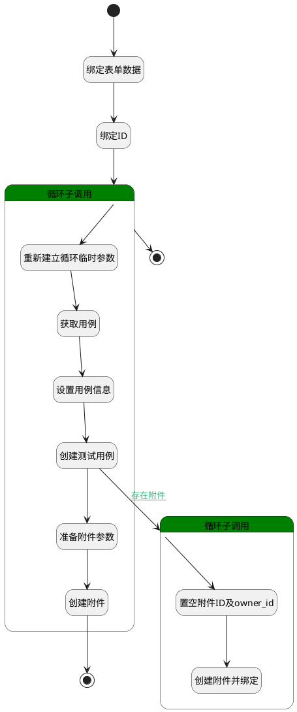

## 复制用例 <!-- {docsify-ignore-all} -->

   复制测试用例

### 处理过程




### 处理步骤说明

#### 开始 :id=Begin<sup class="footnote-symbol"> <font color=gray size=1>[开始]</font></sup>


*- N/A*
#### 绑定表单数据 :id=BINDPARAM1<sup class="footnote-symbol"> <font color=gray size=1>[绑定参数]</font></sup>


绑定参数`Default(传入变量)` 到 `srfactionparam(选择的数据对象)`
#### 绑定ID :id=BINDPARAM2<sup class="footnote-symbol"> <font color=gray size=1>[绑定参数]</font></sup>


绑定参数`Default(传入变量)` 到 `id(要更改状态的主键)`
#### 循环子调用 :id=LOOPSUBCALL1<sup class="footnote-symbol"> <font color=gray size=1>[循环子调用]</font></sup>


循环参数`srfactionparam(选择的数据对象)`，子循环参数使用`for_temp_obj(循环临时变量)`
#### 重新建立循环临时参数 :id=RENEWPARAM1<sup class="footnote-symbol"> <font color=gray size=1>[重新建立参数]</font></sup>


重建参数```temp_obj(临时变量)```
#### 获取用例 :id=DEACTION2<sup class="footnote-symbol"> <font color=gray size=1>[实体行为]</font></sup>


调用实体 [用例(TEST_CASE)](module/TestMgmt/test_case.md) 行为 [Get](module/TestMgmt/test_case#行为) ，行为参数为`id(要更改状态的主键)`

将执行结果返回给参数`temp_obj(临时变量)`

#### 设置用例信息 :id=PREPAREPARAM1<sup class="footnote-symbol"> <font color=gray size=1>[准备参数]</font></sup>


1. 将`temp_obj(临时变量)` 拷贝到  `test_case_new(新测试用例)`
2. 将`空值（NULL）` 设置给  `test_case_new(新测试用例).ATTENTIONS(关注)`
3. 将`空值（NULL）` 设置给  `test_case_new(新测试用例).ATTENTIONS(关注)`
4. 将`temp_obj(临时变量).ATTACHMENTS(附件)` 绑定给  `attachments(附件列表)`
5. 将`for_temp_obj(循环临时变量).TARGET_LIBRARY_ID(目标测试库)` 设置给  `test_case_new(新测试用例).TEST_LIBRARY_ID(测试库)`
6. 将`空值（NULL）` 设置给  `test_case_new(新测试用例).ATTACHMENTS(附件)`
7. 将`for_temp_obj(循环临时变量).SUITE_ID(用例模块标识)` 设置给  `test_case_new(新测试用例).SUITE_ID(用例模块标识)`
8. 将`空值（NULL）` 设置给  `test_case_new(新测试用例).ID(标识)`
9. 将` ==> test_case_new[IDENTIFIER]` 设置给  `test_case_new(新测试用例).IDENTIFIER(编号)`

#### 创建测试用例 :id=DEACTION1<sup class="footnote-symbol"> <font color=gray size=1>[实体行为]</font></sup>


调用实体 [用例(TEST_CASE)](module/TestMgmt/test_case.md) 行为 [Create](module/TestMgmt/test_case#行为) ，行为参数为`test_case_new(新测试用例)`

#### 循环子调用 :id=LOOPSUBCALL2<sup class="footnote-symbol"> <font color=gray size=1>[循环子调用]</font></sup>


循环参数`attachments(附件列表)`，子循环参数使用`attachment(附件)`
#### 置空附件ID及owner_id :id=PREPAREPARAM2<sup class="footnote-symbol"> <font color=gray size=1>[准备参数]</font></sup>


1. 将`空值（NULL）` 设置给  `attachment(附件).ID(标识)`
2. 将`test_case_new(新测试用例).ID(标识)` 设置给  `attachment(附件).OWNER_ID(所属数据标识)`
3. 将`TEST_CASE` 设置给  `attachment(附件).OWNER_TYPE(所属数据对象)`

#### 创建附件并绑定 :id=DEACTION3<sup class="footnote-symbol"> <font color=gray size=1>[实体行为]</font></sup>


调用实体 [附件(ATTACHMENT)](module/Base/attachment.md) 行为 [Create](module/Base/attachment#行为) ，行为参数为`attachment(附件)`

#### 结束 :id=END1<sup class="footnote-symbol"> <font color=gray size=1>[结束]</font></sup>


*- N/A*

#### 准备附件参数 :id=PREPAREPARAM3<sup class="footnote-symbol"> <font color=gray size=1>[准备参数]</font></sup>


1. 将`空值（NULL）` 设置给  `attention(关注人).ID(标识)`
2. 将`TEST_CASE` 设置给  `attention(关注人).OWNER_SUBTYPE(所属对象子类型)`
3. 将`用户全局对象.srfpersonid` 设置给  `attention(关注人).USER_ID(关注人)`
4. 将`40` 设置给  `attention(关注人).TYPE(关注类型)`
5. 将`用户全局对象.srfpersonname` 设置给  `attention(关注人).NAME(名称)`
6. 将`test_case_new(新测试用例).ID(标识)` 设置给  `attention(关注人).OWNER_ID(所属数据标识)`
7. 将`TEST_CASE` 设置给  `attention(关注人).OWNER_TYPE(所属数据对象)`

#### 创建附件 :id=DEACTION4<sup class="footnote-symbol"> <font color=gray size=1>[实体行为]</font></sup>


调用实体 [关注(ATTENTION)](module/Base/attention.md) 行为 [Create](module/Base/attention#行为) ，行为参数为`attention(关注人)`

#### 结束 :id=END2<sup class="footnote-symbol"> <font color=gray size=1>[结束]</font></sup>


*- N/A*


### 连接条件说明
#### 存在附件 :id=DEACTION1-LOOPSUBCALL2

`temp_obj(临时变量).attachments(附件)` ISNOTNULL


### 实体逻辑参数

|    中文名   |    代码名    |  数据类型    |  实体   |备注 |
| --------| --------| -------- | -------- | --------   |
|传入变量(<i class="fa fa-check"/></i>)|Default|数据对象|[用例(TEST_CASE)](module/TestMgmt/test_case.md)||
|附件|attachment|数据对象|[附件(ATTACHMENT)](module/Base/attachment.md)||
|附件列表|attachments|数据对象列表|[附件(ATTACHMENT)](module/Base/attachment.md)||
|关注人|attention|数据对象|[关注(ATTENTION)](module/Base/attention.md)||
|关注人列表|attentions|数据对象列表|[关注(ATTENTION)](module/Base/attention.md)||
|循环临时变量|for_temp_obj|数据对象|[用例(TEST_CASE)](module/TestMgmt/test_case.md)||
|要更改状态的主键|id|简单数据|||
|选中工作项的主键|ids|简单数据列表|||
|选择的数据对象|srfactionparam|数据对象列表|[用例(TEST_CASE)](module/TestMgmt/test_case.md)||
|临时变量|temp_obj|数据对象|[用例(TEST_CASE)](module/TestMgmt/test_case.md)||
|新测试用例|test_case_new|数据对象|[用例(TEST_CASE)](module/TestMgmt/test_case.md)||
