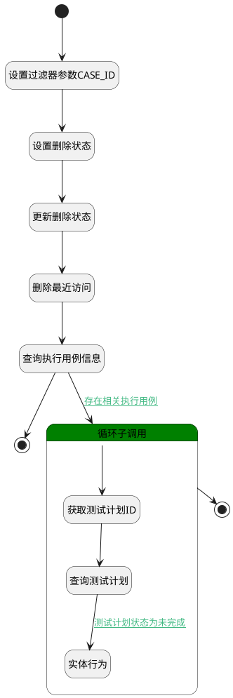

## 删除 <!-- {docsify-ignore-all} -->

   测试用例数据的逻辑删除，修改产品的是否删除属性值

### 处理过程




### 处理步骤说明

#### 开始 :id=Begin<sup class="footnote-symbol"> <font color=gray size=1>[开始]</font></sup>


*- N/A*
#### 设置过滤器参数CASE_ID :id=PREPAREPARAM3<sup class="footnote-symbol"> <font color=gray size=1>[准备参数]</font></sup>


1. 将`Default(传入变量).ID(标识)` 设置给  `fiter(过滤器).N_CASE_ID_EQ`

#### 设置删除状态 :id=PREPAREPARAM1<sup class="footnote-symbol"> <font color=gray size=1>[准备参数]</font></sup>


1. 将`1` 设置给  `Default(传入变量).IS_DELETED(是否已删除)`
2. 将`Default(传入变量).ID(标识)` 设置给  `run_info(执行用例信息).CASE_ID(测试用例标识)`

#### 更新删除状态 :id=DEACTION1<sup class="footnote-symbol"> <font color=gray size=1>[实体行为]</font></sup>


调用实体 [用例(TEST_CASE)](module/TestMgmt/test_case.md) 行为 [Update](module/TestMgmt/test_case#行为) ，行为参数为`Default(传入变量)`

#### 删除最近访问 :id=RAWSQLCALL1<sup class="footnote-symbol"> <font color=gray size=1>[直接SQL调用]</font></sup>


<p class="panel-title"><b>执行sql语句</b></p>

```sql
update recent set IS_DELETED=1 where owner_id=? and owner_subtype='test_case'
```

<p class="panel-title"><b>执行sql参数</b></p>

1. `Default(传入变量).ID(标识)`


#### 结束 :id=END2<sup class="footnote-symbol"> <font color=gray size=1>[结束]</font></sup>


*- N/A*

#### 查询执行用例信息 :id=DEDATAQUERY1<sup class="footnote-symbol"> <font color=gray size=1>[实体数据查询]</font></sup>


调用实体 [执行用例(RUN)](module/TestMgmt/run.md) 数据查询 [数据查询(DEFAULT)](module/TestMgmt/run#数据查询) ，查询参数为`fiter(过滤器)`

将执行结果返回给参数`run_list(执行用例列表)`

#### 循环子调用 :id=LOOPSUBCALL1<sup class="footnote-symbol"> <font color=gray size=1>[循环子调用]</font></sup>


循环参数`run_list(执行用例列表)`，子循环参数使用`temp_obj(临时执行用例对象)`
#### 获取测试计划ID :id=PREPAREPARAM2<sup class="footnote-symbol"> <font color=gray size=1>[准备参数]</font></sup>


1. 将`temp_obj(临时执行用例对象).PLAN_ID(测试计划标识)` 设置给  `test_plan_info(测试计划信息).ID(标识)`

#### 查询测试计划 :id=DEACTION2<sup class="footnote-symbol"> <font color=gray size=1>[实体行为]</font></sup>


调用实体 [测试计划(TEST_PLAN)](module/TestMgmt/test_plan.md) 行为 [Get](module/TestMgmt/test_plan#行为) ，行为参数为`test_plan_info(测试计划信息)`

将执行结果返回给参数`test_plan_info(测试计划信息)`

#### 结束 :id=END1<sup class="footnote-symbol"> <font color=gray size=1>[结束]</font></sup>


返回 `Default(传入变量)`

#### 实体行为 :id=DEACTION3<sup class="footnote-symbol"> <font color=gray size=1>[实体行为]</font></sup>


调用实体 [执行用例(RUN)](module/TestMgmt/run.md) 行为 [Remove](module/TestMgmt/run#行为) ，行为参数为`temp_obj(临时执行用例对象)`


### 连接条件说明
#### 存在相关执行用例 :id=DEDATAQUERY1-LOOPSUBCALL1

`run_list(执行用例列表).size` GT `0`
#### 测试计划状态为未完成 :id=DEACTION2-DEACTION3

(`test_plan_info(测试计划信息).STATUS(状态)` EQ `pending` OR `test_plan_info(测试计划信息).STATUS(状态)` EQ `in_progress`)


### 实体逻辑参数

|    中文名   |    代码名    |  数据类型    |  实体   |备注 |
| --------| --------| -------- | -------- | --------   |
|传入变量(<i class="fa fa-check"/></i>)|Default|数据对象|[用例(TEST_CASE)](module/TestMgmt/test_case.md)||
|过滤器|fiter|过滤器|||
|执行用例信息|run_info|数据对象|[执行用例(RUN)](module/TestMgmt/run.md)||
|执行用例列表|run_list|数据对象列表|[执行用例(RUN)](module/TestMgmt/run.md)||
|临时执行用例对象|temp_obj|数据对象|[执行用例(RUN)](module/TestMgmt/run.md)||
|测试计划信息|test_plan_info|数据对象|[测试计划(TEST_PLAN)](module/TestMgmt/test_plan.md)||
