## 填充最近执行 <!-- {docsify-ignore-all} -->

   填充最近执行

### 处理过程

```plantuml
@startuml
hide empty description
<style>
root {
  HyperlinkColor #42b983
}
</style>

hide empty description
state "开始" as Begin <<start>> [[$./fill_latest_executed#begin {"开始"}]]
state "执行脚本代码" as RAWSFCODE1  [[$./fill_latest_executed#rawsfcode1 {"执行脚本代码"}]]


Begin --> RAWSFCODE1


@enduml
```




### 处理步骤说明

#### 开始 :id=Begin<sup class="footnote-symbol"> <font color=gray size=1>[开始]</font></sup>


*- N/A*
#### 执行脚本代码 :id=RAWSFCODE1<sup class="footnote-symbol"> <font color=gray size=1>[直接后台代码]</font></sup>


<p class="panel-title"><b>执行代码[Groovy]</b></p>

```groovy
def _default = logic.param("Default").real;
def _id = _default.get("id");
def cur_version_id = _default.get("cur_version_id");
def runDERuntime = sys.dataentity("RUN");
def searchContextDTO = runDERuntime.createSearchContext();
searchContextDTO.limit(1).count(false).eq("case_id",_id).nn("status").sort("executed_at,desc");
def args = [searchContextDTO,"SRFVERSIONID",cur_version_id] as Object[];
def page = runDERuntime.fetchDataSet("Default", null, args);
_default.set("latest_executed", page.getContent());
```


### 实体逻辑参数

|    中文名   |    代码名    |  数据类型    |  实体   |备注 |
| --------| --------| -------- | -------- | --------   |
|传入变量(<i class="fa fa-check"/></i>)|Default|数据对象|[用例(TEST_CASE)](module/TestMgmt/test_case.md)||
