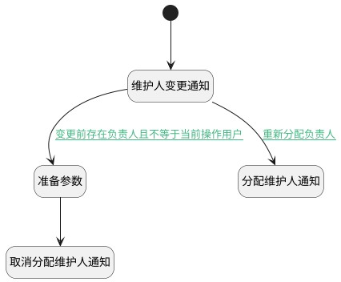

## 维护人变更附加逻辑 <!-- {docsify-ignore-all} -->

   测试用例维护人变更时触发相应的通知消息

### 处理过程

### 处理步骤说明

#### 开始 :id=Begin [开始]

*- N/A*
#### 维护人变更通知 :id=DENOTIFY2 [实体通知]

调用实体 [用例(TEST_CASE)](module/TestMgmt/test_case.md) 通知 [维护人变更通知(maintainer_onchange_notify)](module/TestMgmt/test_case/notify/maintainer_onchange_notify) ，参数为`Default(传入变量)`
#### 准备参数 :id=PREPAREPARAM1 [准备参数]

1. 将`Default(传入变量).UPDATE_MAN(更新人)` 设置给  `Last(变更前).UPDATE_MAN`
2. 将`Default(传入变量).UPDATE_TIME(更新时间)` 设置给  `Last(变更前).UPDATE_TIME`

#### 分配维护人通知 :id=DENOTIFY1 [实体通知]

调用实体 [用例(TEST_CASE)](module/TestMgmt/test_case.md) 通知 [分配维护人通知(maintainer_notify)](module/TestMgmt/test_case/notify/maintainer_notify) ，参数为`Default(传入变量)`
#### 取消分配维护人通知 :id=DENOTIFY3 [实体通知]

调用实体 [用例(TEST_CASE)](module/TestMgmt/test_case.md) 通知 [取消分配维护人通知(maintainer_cancel_notify)](module/TestMgmt/test_case/notify/maintainer_cancel_notify) ，参数为`Last(变更前)`

### 连接条件说明
#### 重新分配负责人 :id=DENOTIFY2-DENOTIFY1

`Default(传入变量).MAINTENANCE_ID(维护人)` ISNOTNULL AND 
#### 变更前存在负责人且不等于当前操作用户 :id=DENOTIFY2-PREPAREPARAM1

`Last(变更前).MAINTENANCE_ID` ISNOTNULL AND 

### 实体逻辑参数

|    中文名   |    代码名    |  数据类型    |  实体   |备注 |
| --------| --------| -------- | -------- | --------   |
|传入变量(<i class="fa fa-check"/></i>)|Default|数据对象|[用例(TEST_CASE)](module/TestMgmt/test_case.md)||
|变更前|Last|最后数据变量|||
