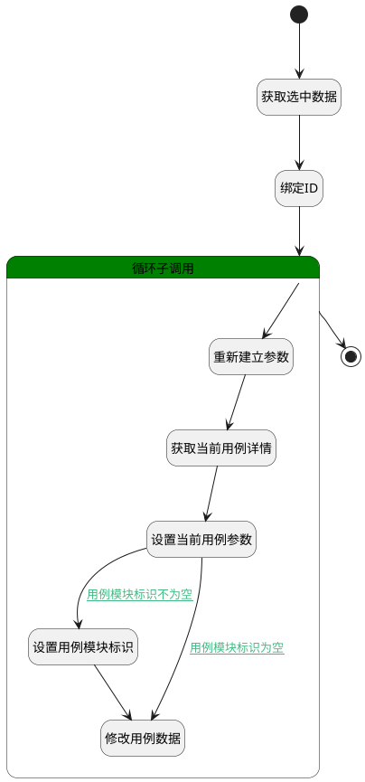

## 移动用例 <!-- {docsify-ignore-all} -->

   移动用例至其他位置（修改用例的所属测试库，重新生成编号）

### 处理过程




### 处理步骤说明

#### 开始 :id=Begin<sup class="footnote-symbol"> <font color=gray size=1>[开始]</font></sup>


*- N/A*
#### 获取选中数据 :id=BINDPARAM1<sup class="footnote-symbol"> <font color=gray size=1>[绑定参数]</font></sup>


绑定参数`Default(传入变量)` 到 `srfactionparam(选中的数据对象)`
#### 绑定ID :id=BINDPARAM2<sup class="footnote-symbol"> <font color=gray size=1>[绑定参数]</font></sup>


绑定参数`Default(传入变量)` 到 `id(要更改状态的主键)`
#### 循环子调用 :id=LOOPSUBCALL1<sup class="footnote-symbol"> <font color=gray size=1>[循环子调用]</font></sup>


循环参数`srfactionparam(选中的数据对象)`，子循环参数使用`for_temp_obj(循环临时变量)`
#### 重新建立参数 :id=RENEWPARAM1<sup class="footnote-symbol"> <font color=gray size=1>[重新建立参数]</font></sup>


重建参数```temp_obj(临时变量)```
#### 获取当前用例详情 :id=DEACTION2<sup class="footnote-symbol"> <font color=gray size=1>[实体行为]</font></sup>


调用实体 [用例(TEST_CASE)](module/TestMgmt/test_case.md) 行为 [Get](module/TestMgmt/test_case#行为) ，行为参数为`id(要更改状态的主键)`

将执行结果返回给参数`temp_obj(临时变量)`

#### 设置当前用例参数 :id=PREPAREPARAM1<sup class="footnote-symbol"> <font color=gray size=1>[准备参数]</font></sup>

设置测试库ID，置空用例ID，重新生成编号

1. 将`for_temp_obj(循环临时变量).TARGET_LIBRARY_ID(目标测试库)` 设置给  `temp_obj(临时变量).TEST_LIBRARY_ID(测试库)`
2. 将` ==> temp_obj[IDENTIFIER]` 设置给  `temp_obj(临时变量).IDENTIFIER(编号)`
3. 将`id(要更改状态的主键)` 设置给  `temp_obj(临时变量).ID(标识)`

#### 设置用例模块标识 :id=PREPAREPARAM2<sup class="footnote-symbol"> <font color=gray size=1>[准备参数]</font></sup>

设置模块ID

1. 将`for_temp_obj(循环临时变量).SUITE_ID(用例模块标识)` 设置给  `temp_obj(临时变量).SUITE_ID(用例模块标识)`

#### 修改用例数据 :id=DEACTION1<sup class="footnote-symbol"> <font color=gray size=1>[实体行为]</font></sup>


调用实体 [用例(TEST_CASE)](module/TestMgmt/test_case.md) 行为 [Update](module/TestMgmt/test_case#行为) ，行为参数为`temp_obj(临时变量)`

#### 结束 :id=END1<sup class="footnote-symbol"> <font color=gray size=1>[结束]</font></sup>


*- N/A*


### 连接条件说明
#### 用例模块标识不为空 :id=PREPAREPARAM1-PREPAREPARAM2

`for_temp_obj(循环临时变量).suite_id(用例模块标识)` ISNOTNULL
#### 用例模块标识为空 :id=PREPAREPARAM1-DEACTION1

`for_temp_obj(循环临时变量).suite_id(用例模块标识)` ISNULL


### 实体逻辑参数

|    中文名   |    代码名    |  数据类型    |  实体   |备注 |
| --------| --------| -------- | -------- | --------   |
|传入变量(<i class="fa fa-check"/></i>)|Default|数据对象|[用例(TEST_CASE)](module/TestMgmt/test_case.md)||
|循环临时变量|for_temp_obj|数据对象|[用例(TEST_CASE)](module/TestMgmt/test_case.md)||
|要更改状态的主键|id|简单数据|||
|选中工作项的主键|ids|简单数据列表|||
|选中的数据对象|srfactionparam|数据对象列表|[用例(TEST_CASE)](module/TestMgmt/test_case.md)||
|临时变量|temp_obj|数据对象|[用例(TEST_CASE)](module/TestMgmt/test_case.md)||
