## 获取最近执行 <!-- {docsify-ignore-all} -->

   获取当前测试用例的最近执行记录

### 处理过程

```plantuml
@startuml
hide empty description
<style>
root {
  HyperlinkColor #42b983
}
</style>

hide empty description
state "开始" as Begin <<start>> [[$./newest_run#begin {"开始"}]]
state "获取测试用例" as DEACTION1  [[$./newest_run#deaction1 {"获取测试用例"}]]
state "获取最近执行信息" as RAWSQLCALL1  [[$./newest_run#rawsqlcall1 {"获取最近执行信息"}]]
state "结束" as END1 <<end>> [[$./newest_run#end1 {"结束"}]]


Begin --> DEACTION1
DEACTION1 --> RAWSQLCALL1
RAWSQLCALL1 --> END1


@enduml
```




### 处理步骤说明

#### 开始 :id=Begin<sup class="footnote-symbol"> <font color=gray size=1>[开始]</font></sup>


*- N/A*
#### 获取测试用例 :id=DEACTION1<sup class="footnote-symbol"> <font color=gray size=1>[实体行为]</font></sup>


调用实体 [用例(TEST_CASE)](module/TestMgmt/test_case.md) 行为 [Get](module/TestMgmt/test_case#行为) ，行为参数为`Default(传入变量)`

将执行结果返回给参数`Default(传入变量)`

#### 获取最近执行信息 :id=RAWSQLCALL1<sup class="footnote-symbol"> <font color=gray size=1>[直接SQL调用]</font></sup>


<p class="panel-title"><b>执行sql语句</b></p>

```sql
select t2.name as test_plan_name,t.EXECUTOR_NAME,t.EXECUTED_AT,t.`STATUS` as run_status from run t,test_plan t2 where  t.CASE_ID=? and t.`STATUS` is not null and t.PLAN_ID=t2.id  order by EXECUTED_AT desc LIMIT 1
```

<p class="panel-title"><b>执行sql参数</b></p>

1. `Default(传入变量).ID(标识)`

重置参数`Default(传入变量)`，并将执行sql结果赋值给参数`Default(传入变量)`

#### 结束 :id=END1<sup class="footnote-symbol"> <font color=gray size=1>[结束]</font></sup>


返回 `Default(传入变量)`


### 实体逻辑参数

|    中文名   |    代码名    |  数据类型    |  实体   |备注 |
| --------| --------| -------- | -------- | --------   |
|传入变量(<i class="fa fa-check"/></i>)|Default|数据对象|[用例(TEST_CASE)](module/TestMgmt/test_case.md)||
