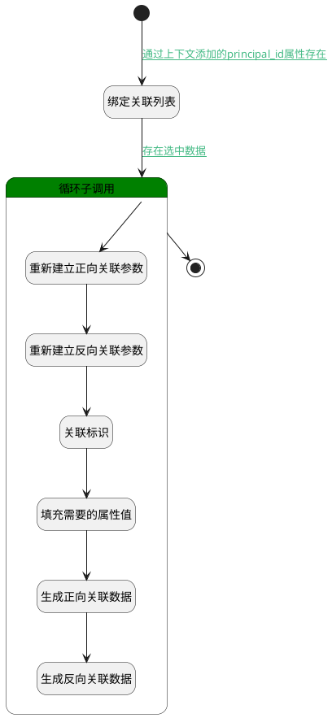

## 其他实体关联用例 <!-- {docsify-ignore-all} -->

   测试用例实体的关联操作，生成正向，反向关联数据

### 处理过程




### 处理步骤说明

#### 开始 :id=Begin<sup class="footnote-symbol"> <font color=gray size=1>[开始]</font></sup>


*- N/A*
#### 绑定关联列表 :id=BINDPARAM1<sup class="footnote-symbol"> <font color=gray size=1>[绑定参数]</font></sup>


绑定参数`Default(传入变量)` 到 `selectdata(关联列表)`
#### 循环子调用 :id=LOOPSUBCALL1<sup class="footnote-symbol"> <font color=gray size=1>[循环子调用]</font></sup>


循环参数`selectdata(关联列表)`，子循环参数使用`for_temp_obj(循环临时变量)`
#### 重新建立正向关联参数 :id=RENEWPARAM1<sup class="footnote-symbol"> <font color=gray size=1>[重新建立参数]</font></sup>


重建参数```forward_relation_obj(正向关系对象)```
#### 重新建立反向关联参数 :id=RENEWPARAM2<sup class="footnote-symbol"> <font color=gray size=1>[重新建立参数]</font></sup>


重建参数```reverse_relation_obj(反向关系对象)```
#### 关联标识 :id=RAWSFCODE1<sup class="footnote-symbol"> <font color=gray size=1>[直接后台代码]</font></sup>


<p class="panel-title"><b>执行代码[Groovy]</b></p>

```groovy
def for_temp_obj = logic.param('for_temp_obj').getReal()

def reverse_relation_obj = logic.param('reverse_relation_obj').getReal()

def forward_relation_obj = logic.param('forward_relation_obj').getReal()


// PC端 使用owner_id   mob端 使用id 
if(for_temp_obj.get('id') != null){
    reverse_relation_obj.set('principal_id', for_temp_obj.get('id'))
    forward_relation_obj.set('target_id', for_temp_obj.get('id'))
}
if(for_temp_obj.get('target_id') != null){
    reverse_relation_obj.set('principal_id', for_temp_obj.get('target_id'))
    forward_relation_obj.set('target_id', for_temp_obj.get('target_id'))
}


```

#### 结束 :id=END1<sup class="footnote-symbol"> <font color=gray size=1>[结束]</font></sup>


*- N/A*

#### 填充需要的属性值 :id=PREPAREPARAM1<sup class="footnote-symbol"> <font color=gray size=1>[准备参数]</font></sup>


1. 将`Default(传入变量).principal_id` 设置给  `forward_relation_obj(正向关系对象).PRINCIPAL_ID(关联主体标识)`
2. 将`Default(传入变量).principal_id` 设置给  `reverse_relation_obj(反向关系对象).TARGET_ID(目标主体标识)`
3. 将`Default(传入变量).target_type` 设置给  `reverse_relation_obj(反向关系对象).PRINCIPAL_TYPE(关联主体类型)`
4. 将`Default(传入变量).principal_type` 设置给  `reverse_relation_obj(反向关系对象).TARGET_TYPE(关联目标类型)`
5. 将`Default(传入变量).principal_type` 设置给  `forward_relation_obj(正向关系对象).PRINCIPAL_TYPE(关联主体类型)`
6. 将`Default(传入变量).target_type` 设置给  `forward_relation_obj(正向关系对象).TARGET_TYPE(关联目标类型)`

#### 生成正向关联数据 :id=DEACTION1<sup class="footnote-symbol"> <font color=gray size=1>[实体行为]</font></sup>


调用实体 [关联(RELATION)](module/Base/relation.md) 行为 [Save](module/Base/relation#行为) ，行为参数为`forward_relation_obj(正向关系对象)`

#### 生成反向关联数据 :id=DEACTION2<sup class="footnote-symbol"> <font color=gray size=1>[实体行为]</font></sup>


调用实体 [关联(RELATION)](module/Base/relation.md) 行为 [Save](module/Base/relation#行为) ，行为参数为`reverse_relation_obj(反向关系对象)`


### 连接条件说明
#### 通过上下文添加的principal_id属性存在 :id=Begin-BINDPARAM1

`Default(传入变量).principal_id` ISNOTNULL
#### 存在选中数据 :id=BINDPARAM1-LOOPSUBCALL1

`selectdata(关联列表).size` GT `0`


### 实体逻辑参数

|    中文名   |    代码名    |  数据类型    |  实体   |备注 |
| --------| --------| -------- | -------- | --------   |
|传入变量(<i class="fa fa-check"/></i>)|Default|数据对象|[用例(TEST_CASE)](module/TestMgmt/test_case.md)||
|循环临时变量|for_temp_obj|数据对象|[用例(TEST_CASE)](module/TestMgmt/test_case.md)||
|正向关系对象|forward_relation_obj|数据对象|[关联(RELATION)](module/Base/relation.md)||
|反向关系对象|reverse_relation_obj|数据对象|[关联(RELATION)](module/Base/relation.md)||
|关联列表|selectdata|数据对象列表|[用例(TEST_CASE)](module/TestMgmt/test_case.md)||
