## 测试计划对比分析 <!-- {docsify-ignore-all} -->

   报表测试计划对比分析数据源

### 处理过程

```plantuml
@startuml
hide empty description
<style>
root {
  HyperlinkColor #42b983
}
</style>

hide empty description
state "开始" as Begin <<start>> [[$./plan_compar_ative_analysis#begin {"开始"}]]
state "直接SQL调用" as RAWSQLCALL1  [[$./plan_compar_ative_analysis#rawsqlcall1 {"直接SQL调用"}]]
state "结束" as END1 <<end>> [[$./plan_compar_ative_analysis#end1 {"结束"}]]


Begin --> RAWSQLCALL1
RAWSQLCALL1 --> END1


@enduml
```




### 处理步骤说明

#### 开始 :id=Begin<sup class="footnote-symbol"> <font color=gray size=1>[开始]</font></sup>


*- N/A*
#### 直接SQL调用 :id=RAWSQLCALL1<sup class="footnote-symbol"> <font color=gray size=1>[直接SQL调用]</font></sup>


<p class="panel-title"><b>执行sql语句</b></p>

```sql
SELECT
    tp.ID AS filter_type,
    tp.Name AS TestPlanName,
    COUNT(r.ID) AS TotalRuns, -- 执行用例数量
    COALESCE(SUM(CASE WHEN r.status IS NOT NULL THEN 1 ELSE 0 END), 0) AS ExecutedRuns, -- 已执行用例数量
    COALESCE(SUM(CASE WHEN r.status = '10' THEN 1 ELSE 0 END), 0) AS PassedRuns, -- 通过的用例数量
    -- 测试执行率：已执行用例数量 / 执行用例数量（
    CONCAT(COALESCE(ROUND(SUM(CASE WHEN r.status IS NOT NULL THEN 1 ELSE 0 END) * 100.0 / NULLIF(COUNT(r.ID), 0), 2), 0.00), '%') AS ExecutionRate,
    -- 测试通过率：通过的用例数量 / 已执行用例数量
    CONCAT(COALESCE(ROUND(SUM(CASE WHEN r.status = '10' THEN 1 ELSE 0 END) * 100.0 / NULLIF(SUM(CASE WHEN r.status IS NOT NULL THEN 1 ELSE 0 END), 0), 2), 0.00), '%') AS PassRate
FROM
    test_plan tp
        LEFT JOIN run r ON tp.ID = r.plan_id
        LEFT JOIN test_case tc ON r.case_id = tc.ID
WHERE
        tc.TEST_LIBRARY_ID = ?
GROUP BY
    tp.ID
ORDER BY
    tp.ID;
```

<p class="panel-title"><b>执行sql参数</b></p>

1. `Default(传入变量).N_TEST_LIBRARY_ID_EQ`

重置参数`result(结果)`，并将执行sql结果赋值给参数`result(结果)`

#### 结束 :id=END1<sup class="footnote-symbol"> <font color=gray size=1>[结束]</font></sup>


返回 `result(结果)`


### 实体逻辑参数

|    中文名   |    代码名    |  数据类型    |  实体   |备注 |
| --------| --------| -------- | -------- | --------   |
|传入变量(<i class="fa fa-check"/></i>)|Default|过滤器|||
|结果|result|数据对象列表|||
