## 测试用例规划分析 <!-- {docsify-ignore-all} -->

   报表测试用例规划分析数据源

### 处理过程

```plantuml
@startuml
hide empty description
<style>
root {
  HyperlinkColor #42b983
}
</style>

hide empty description
state "开始" as Begin <<start>> [[$./program_analyze#begin {"开始"}]]
state "结束" as END1 <<end>> [[$./program_analyze#end1 {"结束"}]]
state "测试用例规划分析" as RAWSQLCALL1  [[$./program_analyze#rawsqlcall1 {"测试用例规划分析"}]]


Begin --> RAWSQLCALL1
RAWSQLCALL1 --> END1


@enduml
```




### 处理步骤说明

#### 开始 :id=Begin<sup class="footnote-symbol"> <font color=gray size=1>[开始]</font></sup>


*- N/A*
#### 结束 :id=END1<sup class="footnote-symbol"> <font color=gray size=1>[结束]</font></sup>


返回 `result(结果)`

#### 测试用例规划分析 :id=RAWSQLCALL1<sup class="footnote-symbol"> <font color=gray size=1>[直接SQL调用]</font></sup>


<p class="panel-title"><b>执行sql语句</b></p>

```sql
SELECT
    times_ranges.times_range as filter_type,
    COALESCE(cases_count, 0) AS count
FROM (
         SELECT '10' AS times_range
         UNION ALL SELECT '20'
         UNION ALL SELECT '30'
         UNION ALL SELECT '40'
         UNION ALL SELECT '50'
         UNION ALL SELECT '60'
     ) times_ranges
         LEFT JOIN (
    SELECT
        CASE
            WHEN plan_count = 0 THEN 10-- '0次'
            WHEN plan_count = 1 THEN 20 -- '1次'
            WHEN plan_count = 2 THEN 30 -- 2次'
            WHEN plan_count BETWEEN 3 AND 5 THEN 40 -- '3~5次'
            WHEN plan_count BETWEEN 6 AND 10 THEN 50 -- '6~10次'
            WHEN plan_count > 10 THEN 60 -- '10次以上'
            END AS times_range,
        COUNT(*) AS cases_count
    FROM (
             SELECT
                 tc.ID AS test_case_id,
                 COUNT(DISTINCT tp.ID) AS plan_count
             FROM
                 test_case tc
                     LEFT JOIN run r ON tc.ID = r.case_id
                     LEFT JOIN test_plan tp ON r.plan_id = tp.ID
             WHERE
                     tc.TEST_LIBRARY_ID = ?
                     AND((? IS NULL OR ? = '') OR FIND_IN_SET(tc.TYPE, ?)) -- 用例类型
                     AND((? IS NULL OR ? = '') OR FIND_IN_SET(tc.LEVEL, ?)) -- 重要程度
                     AND((? IS NULL OR ? = '') OR FIND_IN_SET(tc.STATE, ?)) -- 评审状态
                     AND((? IS NULL OR ? = '') OR FIND_IN_SET(tc.MAINTENANCE_ID, ?)) -- 维护人ID
             GROUP BY
                 tc.ID
         ) AS plan_counts
    GROUP BY
        times_range
) counted_cases ON times_ranges.times_range = counted_cases.times_range
ORDER BY
    FIELD(times_ranges.times_range, '10', '20', '30', '40', '50', '60');
```

<p class="panel-title"><b>执行sql参数</b></p>

1. `Default(传入变量).N_TEST_LIBRARY_ID_EQ`
2. `Default(传入变量).N_TYPE_EQ`
3. `Default(传入变量).N_TYPE_EQ`
4. `Default(传入变量).N_TYPE_EQ`
5. `Default(传入变量).N_LEVEL_EQ`
6. `Default(传入变量).N_LEVEL_EQ`
7. `Default(传入变量).N_LEVEL_EQ`
8. `Default(传入变量).N_STATE_EQ`
9. `Default(传入变量).N_STATE_EQ`
10. `Default(传入变量).N_STATE_EQ`
11. `Default(传入变量).n_maintenance_id_eq`
12. `Default(传入变量).n_maintenance_id_eq`
13. `Default(传入变量).n_maintenance_id_eq`

重置参数`result(结果)`，并将执行sql结果赋值给参数`result(结果)`


### 实体逻辑参数

|    中文名   |    代码名    |  数据类型    |  实体   |备注 |
| --------| --------| -------- | -------- | --------   |
|传入变量(<i class="fa fa-check"/></i>)|Default|过滤器|||
|结果|result|数据对象列表|||
